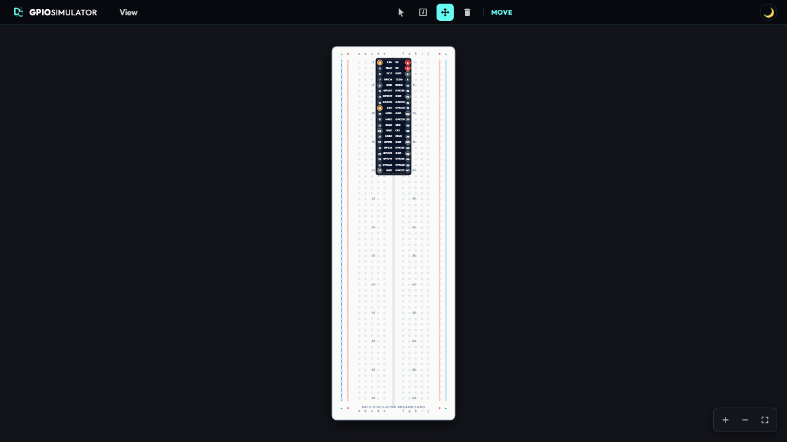

# Gpio Simulator (System.Device.Gpio Shim)

### NuGet Packages
| Package | Stable Version | Pre-Release Version |
|:---|:---|:---|
| **DevDecoder.GpioSimulator** | [](https://www.nuget.org/packages/DevDecoder.GpioSimulator) | [](https://www.nuget.org/packages/DevDecoder.GpioSimulator) |
| **DevDecoder.GpioSimulator.Drivers** | [](https://www.nuget.org/packages/DevDecoder.GpioSimulator.Drivers) | [](https://www.nuget.org/packages/DevDecoder.GpioSimulator.Drivers) |
| **DevDecoder.GpioSimulator.Common** | [](https://www.nuget.org/packages/DevDecoder.GpioSimulator.Common) | [](https://www.nuget.org/packages/DevDecoder.GpioSimulator.Common) |

### Solution Metadata
[](https://opensource.org/licenses/MIT)
[](https://dotnet.microsoft.com/en-us/)
[](https://dotnet.microsoft.com/en-us/)

An extensible, drop-in C# NuGet replacement library for `System.Device.Gpio` that mimics the hardware namespace, but spins up a beautiful browser-based microcontroller visual simulator rather than requiring physical hardware. Designed for teaching, desktop prototyping, and locked-down learning environments.



> [!NOTE]
> **🚀 Out-of-the-Box Compatibility (Targeting .NET 6.0)**
>
> To maximize out-of-the-box compatibility with restricted educational networks and school computer systems (which often run older LTS versions like `.NET 6.0`), the active web-host and samples target `.NET 6.0`.
>
> The simulator will automatically roll forward and run seamlessly on any newer version of .NET (including `.NET 8.0`, `.NET 9.0`, and `.NET 10.0+`) if `.NET 6.0` is not installed on the host machine.

---

## 📦 The Packages & Target Scenarios

The simulator is modularly split into **three NuGet packages** depending on your usage scenario.

> [!IMPORTANT]
> In most target scenarios, you should **only install either** `DevDecoder.GpioSimulator` (Scenario A) **OR** `DevDecoder.GpioSimulator.Drivers` (Scenario B). You **do not** need to explicitly install `DevDecoder.GpioSimulator.Common` as it is automatically pulled in as a dependency by the other packages.

### 1. `DevDecoder.GpioSimulator` (Drop-in Web & Visual Shim)
* **What it is:** The complete drop-in replacement library that replaces the standard `System.Device.Gpio` namespace.
* **When to use:** Use this in your active application, learning environment, or presentation layer.
* **How it works:** Whenever you instantiate `new GpioController()`, it automatically spins up the visual web server (binding strictly to loopback `127.0.0.1:5050` to bypass system firewalls) and launches your system's default browser automatically to interact with the high-fidelity board layout.
* **Installation:**
  ```bash
  dotnet add package DevDecoder.GpioSimulator --version 0.5.0-beta
  ```

### 2. `DevDecoder.GpioSimulator.Drivers` (Offline & Standalone Drivers)
* **What it is:** A standalone driver package containing both `LocalDriver` and `WebAPIDriver`. It automatically pulls in Microsoft's official `System.Device.Gpio` package via its NuGet dependencies.
* **When to use:** Use this when you want to use the **official** Microsoft `GpioController` but inject our simulator drivers into it (for headless unit testing, automated CI/CD, or if you prefer strict separation of concerns).
* **How it works:** You reference this package. You instantiate `LocalDriver` (for headless testing) or `WebAPIDriver` (for the visual simulator) and pass it into Microsoft's `GpioController`.
* **Installation:**
  ```bash
  dotnet add package DevDecoder.GpioSimulator.Drivers --version 0.5.0-beta
  ```

### 3. `DevDecoder.GpioSimulator.Common` (Shared State Simulation Engine)
* **What it is:** The pure class library containing the thread-safe state containers, logical-to-physical conversions, and owner tracking.
* **When to use:** Used under the hood by both of the packages above. You **do not need to install this package directly**, as it is transitively included by both the shim and drivers packages. You only need to explicitly install this if you are building your own completely independent custom GPIO drivers or presentation layers decoupled from our visual simulator.
* **Installation:**
  ```bash
  dotnet add package DevDecoder.GpioSimulator.Common --version 0.5.0-beta
  ```

---

## 🚀 Quick Start

### Scenario A: Visual Prototyping (Using the Shim)
Reference **`DevDecoder.GpioSimulator`**. Your existing code requires **zero changes**—simply write standard `System.Device.Gpio` code:

```csharp
using System;
using System.Device.Gpio;
using System.Threading;

class Program
{
    static void Main()
    {
        // 1. Instantiating GpioController automatically spins up 
        //    the visual web simulator and opens your browser.
        using var controller = new GpioController();
        
        int ledPin = 18;
        controller.OpenPin(ledPin, PinMode.Output);
        
        Console.WriteLine("Blinking pin 18. Watch the web simulator browser tab!");
        
        while (true)
        {
            controller.Write(ledPin, PinValue.High);
            Thread.Sleep(1000);
            controller.Write(ledPin, PinValue.Low);
            Thread.Sleep(1000);
        }
    }
}
```

### Scenario B: Fast, Headless Unit Testing (Using the Official Package)
Reference **`DevDecoder.GpioSimulator.Drivers`** (which automatically includes the official `System.Device.Gpio`). Use `LocalDriver` to test completely offline:

```csharp
using System.Device.Gpio;
using DevDecoder.GpioSimulator;
using Xunit;

public class GpioUnitTests
{
    [Fact]
    public void Test_LED_Toggles_On_Input_Stimulus()
    {
        // 1. Create a local driver and pass it to Microsoft's official GpioController.
        //    Runs 100% in-memory with NO network calls or server processes.
        var driver = new LocalDriver(PinNumberingScheme.Logical);
        using var controller = new GpioController(PinNumberingScheme.Logical, driver);
        
        int switchPin = 23;
        int ledPin = 24;
        
        controller.OpenPin(switchPin, PinMode.Input);
        controller.OpenPin(ledPin, PinMode.Output);
        
        // 2. Set up event callback
        controller.RegisterCallbackForPinValueChangedEvent(switchPin, PinEventTypes.Rising, (sender, args) =>
        {
            controller.Write(ledPin, PinValue.High);
        });
        
        // 3. Inject test stimulus directly to simulate external hardware
        driver.SetPinValue(switchPin, PinValue.High);
        
        // 4. Assert correct state transition
        Assert.Equal(PinValue.High, controller.Read(ledPin));
    }
}
```

### Scenario C: Visual Simulation with Official Package
Reference **`DevDecoder.GpioSimulator.Drivers`** (which automatically includes the official `System.Device.Gpio`). Pass `WebAPIDriver` to Microsoft's controller to get the visual UI without using the shim:

```csharp
using System.Device.Gpio;
using DevDecoder.GpioSimulator;

// 1. Instantiate the WebAPIDriver
var driver = new WebAPIDriver();

// 2. Pass it into the official Microsoft GpioController
using var controller = new GpioController(PinNumberingScheme.Logical, driver);

// Code works exactly like hardware!
controller.OpenPin(18, PinMode.Output);
controller.Write(18, PinValue.High);
```

---

## ✨ Features
* **Drop-in Compatibility**: Uses the identical namespace and APIs as `System.Device.Gpio` (e.g. `GpioController`, `PinMode`, `PinValue`).
* **Interactive Workspace Canvas**: Elegant, high-performance **Pan & Zoom** controls (drag to pan, mousewheel or floating toolbar buttons to zoom, single-click to perfectly fit the board to the workspace screen).
* **Workspace Toolbar**: Select between the standard **Move** tool and **Inspect** tool, with dynamic cursor states and full highlighting/drag selection prevention on controls.
* **Real-time ASP.NET Core UI**: Real-time bidirectional pin synchronization using lightweight WebSockets on `.NET 6.0` (with support for rolling forward to `.NET 8.0+`).
* **Dockable / Toggleable Panels**: Hide or show the Components List and active Log Terminal panes on demand.
* **Multi-Board Extensibility**: Supports simulating multiple different boards (e.g. Raspberry Pi 5, Raspberry Pi 4, Arduino Uno) using metadata-driven JSON Board Schemas.
* **Zero Admin / Firewall Prompts**: Binds strictly to `127.0.0.1` (loopback) to prevent Windows Defender and firewall dialogs on restricted school PCs.
* **Auto-Spawning**: Automatically launches the local web server on the first `GpioController` instantiation and opens your system's default browser automatically.

---

## 🛠️ How to Build

Open the root folder in your terminal or IDE:

1. **Restore dependencies**:
   ```bash
   dotnet restore
   ```
2. **Build the solution**:
   ```bash
   dotnet build
   ```
3. **Run the unit tests**:
   ```bash
   dotnet test
   ```

---

## 📄 License
MIT License. Created by DevDecoder.
