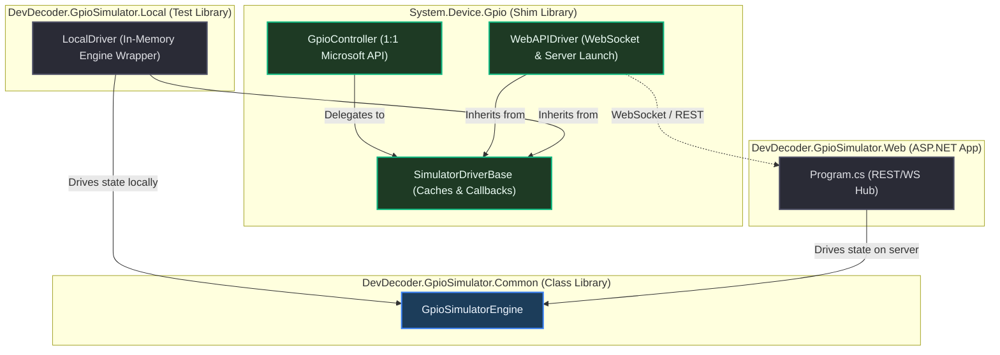

# Implementation Plan: Modular GPIO Driver Abstraction & Separation of Concerns

This plan details the architecture and step-by-step tasks required to implement a robust, high-fidelity GPIO simulator framework. By introducing a central class library for state simulation and decoupling the presentation and transport layers, both offline testing and rich browser-based interactive mock prototyping share the exact same underlying logic.

---

## 📐 Architecture Overview

The system is split into three layers:
1. **Core State & Simulation Engine (`DevDecoder.GpioSimulator.Common`)**: Tracks active board states, pin modes, logical/physical maps, and edge transitions. Completely decoupled from transport (WebSockets) and the `System.Device.Gpio` shim.
2. **Client-Side Platform Shim (`System.Device.Gpio`)**:
   - `GpioController`: A 100% compliant wrapper matching the official Microsoft signature that delegates all pin operations directly to an abstract `GpioDriver`.
   - `SimulatorDriverBase`: Inherits from `GpioDriver`. Implements all shared client-side caching, callback registration, asynchronous execution, and standard event-waiting (`WaitForEvent`).
   - `WebAPIDriver`: Inherits from `SimulatorDriverBase`. Encapsulates WebSocket network frames, REST commands, and ASP.NET Core web server launching.
3. **Local Simulation Transport (`DevDecoder.GpioSimulator.Local`)**: 
   - `LocalDriver`: Inherits from `SimulatorDriverBase`. Wraps `GpioSimulatorEngine` locally in-process to provide a fast, 100% offline, visual-free test harness.



---

## 📦 NuGet Packaging & Dependency Decisions

To prevent duplicate type binding, loader identity collisions, and "DLL Hell" for consumers using both the standard shims and the local test drivers, the following modular packaging design has been decided:
1. **Option A (Separate NuGet Dependency)** is adopted. `DevDecoder.GpioSimulator.Common` will be packaged and published as a standalone NuGet package.
2. **Circular-Free Directional Flow**: `System.Device.Gpio` (the `DevDecoder.GpioSimulator` NuGet) and `DevDecoder.GpioSimulator.Local` will both depend on the separate `DevDecoder.GpioSimulator.Common` package.
3. **Driver Placement**: `SimulatorDriverBase` will remain inside the `System.Device.Gpio` assembly to keep the `Common` library generic and 100% free of `System.Device.Gpio` shim class dependencies, meaning the `Web` server doesn't pull in standard GPIO shims.

---

## 🛠️ Detailed Tasks & Tasks List

```markdown
- [ ] Task 1: Create DevDecoder.GpioSimulator.Common Class Library & GpioSimulatorEngine
- [ ] Task 2: Create standard GpioDriver & SimulatorDriverBase inside System.Device.Gpio shim
- [ ] Task 3: Implement WebAPIDriver under System.Device.Gpio shim
- [ ] Task 4: Create DevDecoder.GpioSimulator.Local Class Library & LocalDriver
- [ ] Task 5: Refactor GpioController to be a 100% compliant Microsoft Delegate Wrapper
- [ ] Task 6: Refactor Web Server to use GpioSimulatorEngine
- [ ] Task 7: Update Unit & Sample Tests to verify both Drivers
```

---

### Task 1: Create DevDecoder.GpioSimulator.Common & GpioSimulatorEngine

**Files:**
- Create: `src/DevDecoder.GpioSimulator.Common/DevDecoder.GpioSimulator.Common.csproj`
- Create: `src/DevDecoder.GpioSimulator.Common/GpioSimulatorEngine.cs`
- Update Solution file to include this project.

- [ ] **Step 1: Create the `.csproj` file**
Create `src/DevDecoder.GpioSimulator.Common/DevDecoder.GpioSimulator.Common.csproj` targeting `netstandard2.0` to be consumable by all projects.

```xml
<Project Sdk="Microsoft.NET.Sdk">
  <PropertyGroup>
    <TargetFramework>netstandard2.0</TargetFramework>
    <Nullable>enable</Nullable>
    <LangVersion>latest</LangVersion>
  </PropertyGroup>
</Project>
```

- [ ] **Step 2: Implement GpioSimulatorEngine.cs**
Implement the thread-safe state engine. It handles logical/physical mappings, pin modes, pin values, owner claims, and exposes public event-hooks:

```csharp
using System;
using System.Collections.Concurrent;
using System.Collections.Generic;

namespace DevDecoder.GpioSimulator.Common
{
    public class GpioSimulatorEngine
    {
        private readonly ConcurrentDictionary<int, string> _pinModes = new ConcurrentDictionary<int, string>();
        private readonly ConcurrentDictionary<int, string> _pinValues = new ConcurrentDictionary<int, string>();
        private readonly ConcurrentDictionary<int, string> _pinOwnerIds = new ConcurrentDictionary<int, string>();
        private readonly ConcurrentDictionary<int, string> _pinOwnerTypes = new ConcurrentDictionary<int, string>();

        public event Action<int, string, string, string, string>? PinStateChanged; // physicalPin, mode, value, ownerId, ownerType
        public event Action<int>? PinClosed; // physicalPin
        public event Action<string, Dictionary<int, int>>? BoardChanged; // boardId, activePhysToLog

        private readonly object _mappingLock = new object();
        private string _activeBoardId = "raspberry_pi_5_breakout";
        private Dictionary<int, int> _activePhysToLog = new Dictionary<int, int>();
        private Dictionary<int, int> _activeLogToPhys = new Dictionary<int, int>();

        public string ActiveBoardId
        {
            get { lock (_mappingLock) return _activeBoardId; }
        }

        public Dictionary<int, int> ActivePhysToLog
        {
            get { lock (_mappingLock) return new Dictionary<int, int>(_activePhysToLog); }
        }

        public Dictionary<int, int> ActiveLogToPhys
        {
            get { lock (_mappingLock) return new Dictionary<int, int>(_activeLogToPhys); }
        }

        public void LoadBoardMapping(string boardId, Dictionary<int, int> physToLog)
        {
            var logToPhys = new Dictionary<int, int>();
            foreach (var kvp in physToLog)
            {
                logToPhys[kvp.Value] = kvp.Key;
            }

            lock (_mappingLock)
            {
                _activeBoardId = boardId;
                _activePhysToLog = physToLog;
                _activeLogToPhys = logToPhys;
            }

            BoardChanged?.Invoke(boardId, physToLog);
        }

        public bool IsValidPhysicalPin(int physicalPin)
        {
            lock (_mappingLock)
            {
                return _activePhysToLog.ContainsKey(physicalPin);
            }
        }

        public bool IsValidLogicalPin(int logicalPin)
        {
            lock (_mappingLock)
            {
                return _activeLogToPhys.ContainsKey(logicalPin);
            }
        }

        public int ConvertLogicalToPhysical(int logicalPin)
        {
            lock (_mappingLock)
            {
                return _activeLogToPhys.TryGetValue(logicalPin, out int phys) ? phys : -1;
            }
        }

        public int ConvertPhysicalToLogical(int physicalPin)
        {
            lock (_mappingLock)
            {
                return _activePhysToLog.TryGetValue(physicalPin, out int log) ? log : -1;
            }
        }

        public bool TryOpenPin(int physicalPin, string mode, string ownerId, string ownerType, out string? errorType, out string? errorMessage)
        {
            errorType = null;
            errorMessage = null;

            if (!IsValidPhysicalPin(physicalPin))
            {
                errorType = "ArgumentException";
                errorMessage = $"Pin {physicalPin} is not a valid physical pin for this board.";
                return false;
            }

            if (_pinModes.ContainsKey(physicalPin))
            {
                errorType = "InvalidOperationException";
                errorMessage = $"Pin {physicalPin} is already open.";
                return false;
            }

            _pinModes[physicalPin] = mode;
            var defaultVal = mode == "InputPullUp" ? "High" : "Low";
            _pinValues[physicalPin] = defaultVal;
            _pinOwnerIds[physicalPin] = ownerId;
            _pinOwnerTypes[physicalPin] = ownerType;

            PinStateChanged?.Invoke(physicalPin, mode, defaultVal, ownerId, ownerType);
            return true;
        }

        public void ClosePin(int physicalPin)
        {
            if (_pinModes.TryRemove(physicalPin, out _))
            {
                _pinValues.TryRemove(physicalPin, out _);
                _pinOwnerIds.TryRemove(physicalPin, out _);
                _pinOwnerTypes.TryRemove(physicalPin, out _);
                PinClosed?.Invoke(physicalPin);
            }
        }

        public void WritePin(int physicalPin, string value, string ownerId, string ownerType)
        {
            if (!_pinModes.ContainsKey(physicalPin)) return;

            _pinValues[physicalPin] = value;
            PinStateChanged?.Invoke(physicalPin, _pinModes[physicalPin], value, ownerId, ownerType);
        }

        public string ReadPin(int physicalPin)
        {
            return _pinValues.TryGetValue(physicalPin, out var val) ? val : "Low";
        }

        public void SetPinMode(int physicalPin, string mode)
        {
            if (!_pinModes.ContainsKey(physicalPin)) return;

            _pinModes[physicalPin] = mode;
            var defaultVal = mode == "InputPullUp" ? "High" : "Low";
            _pinValues[physicalPin] = defaultVal;

            _pinOwnerIds.TryGetValue(physicalPin, out var ownerId);
            _pinOwnerTypes.TryGetValue(physicalPin, out var ownerType);

            PinStateChanged?.Invoke(physicalPin, mode, defaultVal, ownerId ?? "", ownerType ?? "");
        }

        public string GetPinMode(int physicalPin)
        {
            return _pinModes.TryGetValue(physicalPin, out var mode) ? mode : "None";
        }

        public bool IsPinOpen(int physicalPin)
        {
            return _pinModes.ContainsKey(physicalPin);
        }

        public Dictionary<int, (string Mode, string Value, string OwnerId, string OwnerType)> GetAllPinStates()
        {
            var states = new Dictionary<int, (string Mode, string Value, string OwnerId, string OwnerType)>();
            foreach (var pin in _pinModes.Keys)
            {
                _pinModes.TryGetValue(pin, out var mode);
                _pinValues.TryGetValue(pin, out var value);
                _pinOwnerIds.TryGetValue(pin, out var ownerId);
                _pinOwnerTypes.TryGetValue(pin, out var ownerType);
                states[pin] = (mode ?? "None", value ?? "Low", ownerId ?? "", ownerType ?? "");
            }
            return states;
        }
    }
}
```

- [ ] **Step 3: Register in SLN file**
Add the new project to `DevDecoder.GpioSimulator.sln`.

---

### Task 2: Create Standard GpioDriver & SimulatorDriverBase inside Shim

**Files:**
- Create: `src/System.Device.Gpio/GpioDriver.cs`
- Create: `src/System.Device.Gpio/SimulatorDriverBase.cs`

- [ ] **Step 1: Implement GpioDriver.cs**
Implement Microsoft's official abstract class definition in `src/System.Device.Gpio/GpioDriver.cs`:

```csharp
using System;
using System.Threading;

namespace System.Device.Gpio
{
    public abstract class GpioDriver : IDisposable
    {
        protected internal abstract int PinCount { get; }
        protected internal abstract int ConvertPinNumberToLogicalNumberingScheme(int pinNumber);
        protected internal abstract void OpenPin(int pinNumber);
        protected internal abstract void ClosePin(int pinNumber);
        protected internal abstract void Write(int pinNumber, PinValue value);
        protected internal abstract PinValue Read(int pinNumber);
        protected internal abstract void SetPinMode(int pinNumber, PinMode mode);
        protected internal abstract PinMode GetPinMode(int pinNumber);
        protected internal abstract bool IsPinModeSupported(int pinNumber, PinMode mode);
        protected internal abstract void RegisterCallbackForPinValueChangedEvent(int pinNumber, PinEventTypes eventTypes, PinChangeEventHandler callback);
        protected internal abstract void UnregisterCallbackForPinValueChangedEvent(int pinNumber, PinChangeEventHandler callback);
        protected internal abstract WaitForEventResult WaitForEvent(int pinNumber, PinEventTypes eventTypes, TimeSpan timeout);
        protected internal virtual WaitForEventResult WaitForEvent(int pinNumber, PinEventTypes eventTypes, CancellationToken cancellationToken)
        {
            throw new NotImplementedException();
        }
        protected internal virtual void Write(ReadOnlySpan<PinValuePair> pinValuePairs)
        {
            foreach (var pair in pinValuePairs)
            {
                Write(pair.PinNumber, pair.PinValue);
            }
        }
        protected internal virtual void Read(Span<PinValuePair> pinValuePairs)
        {
            for (int i = 0; i < pinValuePairs.Length; i++)
            {
                pinValuePairs[i] = new PinValuePair(pinValuePairs[i].PinNumber, Read(pinValuePairs[i].PinNumber));
            }
        }
        protected internal abstract bool IsPinOpen(int pinNumber);

        protected abstract void Dispose(bool disposing);
        public void Dispose()
        {
            Dispose(true);
            GC.SuppressFinalize(this);
        }
    }
}
```

- [ ] **Step 2: Implement SimulatorDriverBase.cs**
Implement the common **client-side** driver infrastructure in `src/System.Device.Gpio/SimulatorDriverBase.cs`. It tracks the client-side state caching, registered delegate callbacks, and executes generic callback firing and event blocking:

```csharp
using System;
using System.Collections.Concurrent;
using System.Threading;
using System.Threading.Tasks;

namespace System.Device.Gpio
{
    public abstract class SimulatorDriverBase : GpioDriver
    {
        protected readonly ConcurrentDictionary<int, PinMode> OpenPins = new ConcurrentDictionary<int, PinMode>();
        protected readonly ConcurrentDictionary<int, PinValue> PinValues = new ConcurrentDictionary<int, PinValue>();
        protected readonly ConcurrentDictionary<int, ConcurrentBag<(PinEventTypes Types, PinChangeEventHandler Handler)>> Callbacks = 
            new ConcurrentDictionary<int, ConcurrentBag<(PinEventTypes Types, PinChangeEventHandler Handler)>>();

        public PinNumberingScheme NumberingScheme { get; }

        protected SimulatorDriverBase(PinNumberingScheme numberingScheme)
        {
            NumberingScheme = numberingScheme;
        }

        protected internal override int PinCount => 40;

        protected internal override int ConvertPinNumberToLogicalNumberingScheme(int pinNumber) => pinNumber;

        protected internal override void OpenPin(int pinNumber)
        {
            OpenPin(pinNumber, PinMode.Input);
        }

        protected internal override void OpenPin(int pinNumber, PinMode mode)
        {
            OpenPinInternal(pinNumber, mode);
            OpenPins[pinNumber] = mode;
            var defaultVal = mode == PinMode.InputPullUp ? PinValue.High : PinValue.Low;
            PinValues[pinNumber] = defaultVal;
        }

        protected internal override void ClosePin(int pinNumber)
        {
            ClosePinInternal(pinNumber);
            OpenPins.TryRemove(pinNumber, out _);
            PinValues.TryRemove(pinNumber, out _);
        }

        protected internal override void Write(int pinNumber, PinValue value)
        {
            if (!OpenPins.ContainsKey(pinNumber))
                throw new InvalidOperationException($"Pin {pinNumber} is not open.");

            WriteInternal(pinNumber, value);
            PinValues[pinNumber] = value;
        }

        protected internal override PinValue Read(int pinNumber)
        {
            if (!OpenPins.ContainsKey(pinNumber))
                throw new InvalidOperationException($"Pin {pinNumber} is not open.");

            return ReadInternal(pinNumber);
        }

        protected internal override void SetPinMode(int pinNumber, PinMode mode)
        {
            if (!OpenPins.ContainsKey(pinNumber))
                throw new InvalidOperationException($"Pin {pinNumber} is not open.");

            SetPinModeInternal(pinNumber, mode);
            OpenPins[pinNumber] = mode;
            var defaultVal = mode == PinMode.InputPullUp ? PinValue.High : PinValue.Low;
            PinValues[pinNumber] = defaultVal;
        }

        protected internal override PinMode GetPinMode(int pinNumber)
        {
            if (!OpenPins.TryGetValue(pinNumber, out var mode))
                throw new InvalidOperationException($"Pin {pinNumber} is not open.");

            return mode;
        }

        protected internal override bool IsPinOpen(int pinNumber)
        {
            return OpenPins.ContainsKey(pinNumber);
        }

        protected internal override bool IsPinModeSupported(int pinNumber, PinMode mode)
        {
            return mode == PinMode.Input || 
                   mode == PinMode.Output || 
                   mode == PinMode.InputPullUp || 
                   mode == PinMode.InputPullDown;
        }

        protected internal override void RegisterCallbackForPinValueChangedEvent(int pinNumber, PinEventTypes eventTypes, PinChangeEventHandler callback)
        {
            var list = Callbacks.GetOrAdd(pinNumber, _ => new ConcurrentBag<(PinEventTypes, PinChangeEventHandler)>());
            list.Add((eventTypes, callback));
        }

        protected internal override void UnregisterCallbackForPinValueChangedEvent(int pinNumber, PinChangeEventHandler callback)
        {
            if (Callbacks.TryGetValue(pinNumber, out var list))
            {
                var items = list.ToArray();
                var remaining = new ConcurrentBag<(PinEventTypes, PinChangeEventHandler)>();
                foreach (var item in items)
                {
                    if (item.Handler != callback)
                    {
                        remaining.Add(item);
                    }
                }
                Callbacks[pinNumber] = remaining;
            }
        }

        protected internal override WaitForEventResult WaitForEvent(int pinNumber, PinEventTypes eventTypes, TimeSpan timeout)
        {
            using (var cts = new CancellationTokenSource(timeout))
            {
                return WaitForEvent(pinNumber, eventTypes, cts.Token);
            }
        }

        protected internal override WaitForEventResult WaitForEvent(int pinNumber, PinEventTypes eventTypes, CancellationToken cancellationToken)
        {
            var tcs = new TaskCompletionSource<PinEventTypes>();
            
            PinChangeEventHandler tempHandler = (sender, args) =>
            {
                tcs.TrySetResult(args.ChangeType);
            };

            RegisterCallbackForPinValueChangedEvent(pinNumber, eventTypes, tempHandler);

            try
            {
                using (cancellationToken.Register(() => tcs.TrySetCanceled()))
                {
                    tcs.Task.Wait(cancellationToken);
                    
                    return new WaitForEventResult
                    {
                        TimedOut = false,
                        EventTypes = tcs.Task.Result
                    };
                }
            }
            catch (OperationCanceledException)
            {
                return new WaitForEventResult
                {
                    TimedOut = true,
                    EventTypes = PinEventTypes.None
                };
            }
            catch (AggregateException ex) when (ex.InnerException is OperationCanceledException)
            {
                return new WaitForEventResult
                {
                    TimedOut = true,
                    EventTypes = PinEventTypes.None
                };
            }
            finally
            {
                UnregisterCallbackForPinValueChangedEvent(pinNumber, tempHandler);
            }
        }

        protected void UpdatePinValue(int pinNumber, PinValue value)
        {
            PinValues[pinNumber] = value;
        }

        protected void ClearPinCache(int pinNumber)
        {
            OpenPins.TryRemove(pinNumber, out _);
            PinValues.TryRemove(pinNumber, out _);
        }

        protected void FireCallbacks(int pinNumber, PinEventTypes occurredType)
        {
            if (Callbacks.TryGetValue(pinNumber, out var list))
            {
                foreach (var item in list)
                {
                    if ((item.Types & occurredType) != PinEventTypes.None)
                    {
                        try
                        {
                            Task.Run(() => item.Handler(this, new PinValueChangedEventArgs(occurredType, pinNumber)));
                        }
                        catch { }
                    }
                }
            }
        }

        protected abstract int ConvertPin(int pinNumber);
        protected abstract void OpenPinInternal(int pinNumber, PinMode mode);
        protected abstract void ClosePinInternal(int pinNumber);
        protected abstract void WriteInternal(int pinNumber, PinValue value);
        protected abstract PinValue ReadInternal(int pinNumber);
        protected abstract void SetPinModeInternal(int pinNumber, PinMode mode);
        protected abstract PinMode GetPinModeInternal(int pinNumber);

        protected override void Dispose(bool disposing)
        {
            if (disposing)
            {
                OpenPins.Clear();
                PinValues.Clear();
                Callbacks.Clear();
            }
        }
    }
}
```

---

### Task 3: Implement WebAPIDriver under Shim

**Files:**
- Create: `src/System.Device.Gpio/WebAPIDriver.cs`

- [ ] **Step 1: Implement WebAPIDriver.cs**
This driver handles ASP.NET launching, WebSocket listening, physical/logical conversion (retrieved dynamically from the active board layout configuration), and maps the incoming web-based states back to client-side callback notifications.

```csharp
using System;
using System.Collections.Concurrent;
using System.Diagnostics;
using System.IO;
using System.Net.Http;
using System.Net.WebSockets;
using System.Text;
using System.Threading;
using System.Threading.Tasks;

namespace System.Device.Gpio
{
    public class WebAPIDriver : SimulatorDriverBase
    {
        private ClientWebSocket? _wsClient;
        private readonly CancellationTokenSource _cts = new CancellationTokenSource();
        private static readonly HttpClient _httpClient = new HttpClient();
        
        private readonly ConcurrentDictionary<int, int> _activePhysToLog = new ConcurrentDictionary<int, int>();
        private readonly ConcurrentDictionary<int, int> _activeLogToPhys = new ConcurrentDictionary<int, int>();
        private readonly object _mappingLock = new object();
        private readonly ManualResetEventSlim _initialMappingReceived = new ManualResetEventSlim(false);

        private class OpenPinResult
        {
            public bool Success { get; set; }
            public string? ErrorType { get; set; }
            public string? ErrorMessage { get; set; }
        }

        private readonly ConcurrentDictionary<string, TaskCompletionSource<OpenPinResult>> _pendingRequests = 
            new ConcurrentDictionary<string, TaskCompletionSource<OpenPinResult>>();

        public WebAPIDriver(PinNumberingScheme numberingScheme = PinNumberingScheme.Logical) : base(numberingScheme)
        {
            EnsureServerStartedAndConnected().GetAwaiter().GetResult();
        }

        protected override int ConvertPin(int pinNumber)
        {
            lock (_mappingLock)
            {
                if (NumberingScheme == PinNumberingScheme.Logical)
                {
                    if (!_activeLogToPhys.TryGetValue(pinNumber, out int phys))
                        throw new ArgumentException($"Pin {pinNumber} is not a valid logical pin on the current board mapping.");
                    return phys;
                }
                else
                {
                    if (!_activePhysToLog.ContainsKey(pinNumber))
                        throw new ArgumentException($"Pin {pinNumber} is not a valid physical pin on the current board mapping.");
                    return pinNumber;
                }
            }
        }

        private void Log(string level, string message)
        {
            string formatted = $"[Driver] [{level}] {message}";
            if (_wsClient != null && _wsClient.State == WebSocketState.Open)
            {
                try
                {
                    string escapedMessage = formatted.Replace("\"", "\\\"");
                    var payload = $"{{\"action\":\"log\",\"pin\":0,\"value\":\"{escapedMessage}\",\"mode\":\"\"}}";
                    var bytes = Encoding.UTF8.GetBytes(payload);
                    _wsClient.SendAsync(new ArraySegment<byte>(bytes), WebSocketMessageType.Text, true, CancellationToken.None)
                             .GetAwaiter().GetResult();
                    return;
                }
                catch { }
            }
            Console.WriteLine($"[{DateTime.Now:HH:mm:ss} GPIO Simulator] {formatted}");
        }

        private static void ReadStream(StreamReader reader)
        {
            try
            {
                while (!reader.EndOfStream)
                {
                    var line = reader.ReadLine();
                    if (line != null)
                    {
                        System.Diagnostics.Debug.WriteLine(line);
                    }
                }
            }
            catch { }
        }

        private async Task EnsureServerStartedAndConnected()
        {
            string serverUrl = "http://127.0.0.1:5050";
            bool serverActive = false;

            try
            {
                var response = await _httpClient.GetAsync($"{serverUrl}/api/status");
                serverActive = response.IsSuccessStatusCode;
            }
            catch { }

            if (!serverActive)
            {
                string baseDir = AppDomain.CurrentDomain.BaseDirectory;
                if (TryFindDevWebDll(baseDir, out string dllPath))
                {
                    var startInfo = new ProcessStartInfo
                    {
                        FileName = "dotnet",
                        Arguments = $"--roll-forward Major \"{dllPath}\" --urls {serverUrl}",
                        CreateNoWindow = true,
                        UseShellExecute = false,
                        WorkingDirectory = Path.GetDirectoryName(dllPath),
                        RedirectStandardOutput = true,
                        RedirectStandardError = true
                    };
                    startInfo.EnvironmentVariables["ASPNETCORE_ENVIRONMENT"] = "Development";
                    
                    var process = Process.Start(startInfo);
                    if (process != null)
                    {
                        _ = Task.Run(() => ReadStream(process.StandardOutput));
                        _ = Task.Run(() => ReadStream(process.StandardError));
                    }
                    
                    await Task.Delay(2000);
                }
                
                if (string.IsNullOrEmpty(Environment.GetEnvironmentVariable("CI")))
                {
                    BrowserLauncher.Open(serverUrl);
                }
            }

            try
            {
                _wsClient = new ClientWebSocket();
                using (var connectCts = new CancellationTokenSource(TimeSpan.FromSeconds(5)))
                {
                    await _wsClient.ConnectAsync(new Uri($"ws://127.0.0.1:5050/ws?client=controller&scheme={NumberingScheme}"), connectCts.Token);
                }
                
                _ = Task.Run(ReceiveWebSocketMessages);

                if (!_initialMappingReceived.Wait(TimeSpan.FromSeconds(5)))
                {
                    throw new InvalidOperationException("Failed to receive initial board mapping from simulator server within the timeout period.");
                }
            }
            catch (Exception ex)
            {
                _wsClient?.Dispose();
                _wsClient = null;
                throw new InvalidOperationException("Failed to connect to the simulator server over WebSocket.", ex);
            }
        }

        private static string? GetJsonValue(string msg, string key)
        {
            int index = msg.IndexOf($"\"{key}\":");
            if (index == -1) return null;
            index += key.Length + 3;
            
            while (index < msg.Length && (msg[index] == ' ' || msg[index] == '"'))
            {
                index++;
            }
            
            int end = index;
            while (end < msg.Length && msg[end] != '"' && msg[end] != ',' && msg[end] != '}' && msg[end] != '\r' && msg[end] != '\n')
            {
                end++;
            }
            
            if (end > index)
            {
                return msg.Substring(index, end - index).Trim();
            }
            return null;
        }

        private async Task ReceiveWebSocketMessages()
        {
            var buffer = new byte[1024 * 4];
            try
            {
                while (_wsClient != null && _wsClient.State == WebSocketState.Open && !_cts.Token.IsCancellationRequested)
                {
                    var result = await _wsClient.ReceiveAsync(new ArraySegment<byte>(buffer), _cts.Token);
                    if (result.MessageType == WebSocketMessageType.Close) break;

                    var msg = Encoding.UTF8.GetString(buffer, 0, result.Count);
                    
                    if (msg.Contains("\"action\":\"open_response\""))
                    {
                        var requestId = GetJsonValue(msg, "requestId");
                        var status = GetJsonValue(msg, "status");
                        var errorType = GetJsonValue(msg, "errorType");
                        var errorMessage = GetJsonValue(msg, "errorMessage");
                        
                        if (requestId != null && _pendingRequests.TryGetValue(requestId, out var tcs))
                        {
                            tcs.TrySetResult(new OpenPinResult
                            {
                                Success = status == "success",
                                ErrorType = errorType,
                                ErrorMessage = errorMessage
                            });
                        }
                    }
                    else if (msg.Contains("\"action\":\"state_change\"") || msg.Contains("\"action\":\"write\""))
                    {
                        var pinStr = GetJsonValue(msg, "pin");
                        var valStr = GetJsonValue(msg, "value");
                        
                        if (int.TryParse(pinStr, out int pin) && valStr != null)
                        {
                            PinValue val = valStr == "High" ? PinValue.High : PinValue.Low;
                            
                            PinValue oldVal = PinValues.GetOrAdd(pin, PinValue.Low);
                            if (oldVal != val)
                            {
                                UpdatePinValue(pin, val);
                                PinEventTypes occurredType = val == PinValue.High ? PinEventTypes.Rising : PinEventTypes.Falling;
                                FireCallbacks(pin, occurredType);
                            }
                        }
                    }
                    else if (msg.Contains("\"action\":\"close\""))
                    {
                        var pinStr = GetJsonValue(msg, "pin");
                        if (int.TryParse(pinStr, out int pin))
                        {
                            ClearPinCache(pin);
                        }
                    }
                    else if (msg.Contains("\"action\":\"board_change\""))
                    {
                        int pinsIndex = msg.IndexOf("\"pins\":");
                        if (pinsIndex != -1)
                        {
                            int startIndex = msg.IndexOf('{', pinsIndex);
                            int endIndex = msg.IndexOf('}', startIndex);
                            if (startIndex != -1 && endIndex != -1)
                            {
                                var pinsContent = msg.Substring(startIndex + 1, endIndex - startIndex - 1);
                                var pairs = pinsContent.Split(',');
                                var tempPhysToLog = new System.Collections.Generic.Dictionary<int, int>();
                                var tempLogToPhys = new System.Collections.Generic.Dictionary<int, int>();
                                foreach (var pair in pairs)
                                {
                                    var parts = pair.Split(':');
                                    if (parts.Length == 2)
                                    {
                                        var physStr = parts[0].Trim('"', ' ', '\r', '\n');
                                        var logStr = parts[1].Trim('"', ' ', '\r', '\n');
                                        if (int.TryParse(physStr, out int phys) && int.TryParse(logStr, out int log))
                                        {
                                            tempPhysToLog[phys] = log;
                                            tempLogToPhys[log] = phys;
                                        }
                                    }
                                }
                                lock (_mappingLock)
                                {
                                    _activePhysToLog.Clear();
                                    _activeLogToPhys.Clear();
                                    foreach (var kvp in tempPhysToLog) _activePhysToLog[kvp.Key] = kvp.Value;
                                    foreach (var kvp in tempLogToPhys) _activeLogToPhys[kvp.Key] = kvp.Value;
                                }
                                _initialMappingReceived.Set();
                            }
                        }
                    }
                }
            }
            catch { }
        }

        protected override void OpenPinInternal(int pinNumber, PinMode mode)
        {
            if (_wsClient != null && _wsClient.State == WebSocketState.Open)
            {
                var requestId = Guid.NewGuid().ToString();
                var tcs = new TaskCompletionSource<OpenPinResult>();
                _pendingRequests[requestId] = tcs;
                
                var payload = $"{{\"action\":\"open\",\"pin\":{pinNumber},\"mode\":\"{mode}\",\"requestId\":\"{requestId}\"}}";
                var bytes = Encoding.UTF8.GetBytes(payload);
                _wsClient.SendAsync(new ArraySegment<byte>(bytes), WebSocketMessageType.Text, true, CancellationToken.None).GetAwaiter().GetResult();
                
                if (!tcs.Task.Wait(TimeSpan.FromSeconds(5)))
                {
                    _pendingRequests.TryRemove(requestId, out _);
                    throw new TimeoutException($"Timeout waiting for simulator server to open pin {pinNumber}.");
                }
                
                _pendingRequests.TryRemove(requestId, out _);
                
                var result = tcs.Task.Result;
                if (!result.Success)
                {
                    if (result.ErrorType == "ArgumentException") throw new ArgumentException(result.ErrorMessage);
                    if (result.ErrorType == "InvalidOperationException") throw new InvalidOperationException(result.ErrorMessage);
                    throw new Exception(result.ErrorMessage);
                }
            }
            else
            {
                throw new InvalidOperationException("Failed to open pin: The driver is not connected to the simulator server.");
            }
        }

        protected override void ClosePinInternal(int pinNumber)
        {
            SendPinMessage(pinNumber, "close", "");
        }

        protected override void WriteInternal(int pinNumber, PinValue value)
        {
            SendPinMessage(pinNumber, "write", value.ToString());
        }

        protected override PinValue ReadInternal(int pinNumber)
        {
            SendPinMessage(pinNumber, "read", "");
            return PinValues.TryGetValue(pinNumber, out var val) ? val : PinValue.Low;
        }

        protected override void SetPinModeInternal(int pinNumber, PinMode mode)
        {
            SendPinMessage(pinNumber, "mode", mode.ToString());
        }

        protected override PinMode GetPinModeInternal(int pinNumber)
        {
            return OpenPins.TryGetValue(pinNumber, out var mode) ? mode : PinMode.Input;
        }

        private void SendPinMessage(int pinNumber, string action, string data)
        {
            if (_wsClient != null && _wsClient.State == WebSocketState.Open)
            {
                var payload = $"{{\"action\":\"{action}\",\"pin\":{pinNumber},\"value\":\"{data}\",\"mode\":\"{data}\"}}";
                var bytes = Encoding.UTF8.GetBytes(payload);
                _wsClient.SendAsync(new ArraySegment<byte>(bytes), WebSocketMessageType.Text, true, CancellationToken.None).GetAwaiter().GetResult();
            }
        }

        private static bool TryFindDevWebDll(string baseDir, out string dllPath)
        {
            dllPath = Path.Combine(baseDir, "simulator", "DevDecoder.GpioSimulator.Web.dll");
            if (File.Exists(dllPath)) return true;

            dllPath = null!;
            var dir = new DirectoryInfo(baseDir);
            while (dir != null)
            {
                var webAppDir = Path.Combine(dir.FullName, "src", "DevDecoder.GpioSimulator.Web");
                if (!Directory.Exists(webAppDir)) webAppDir = Path.Combine(dir.FullName, "DevDecoder.GpioSimulator.Web");

                if (Directory.Exists(webAppDir))
                {
                    var binPath = Path.Combine(webAppDir, "bin");
                    if (Directory.Exists(binPath))
                    {
                        var configurations = new[] { "Debug", "Release" };
                        foreach (var config in configurations)
                        {
                            var configPath = Path.Combine(binPath, config);
                            if (Directory.Exists(configPath))
                            {
                                foreach (var frameworkDir in Directory.GetDirectories(configPath, "net*"))
                                {
                                    var targetDll = Path.Combine(frameworkDir, "DevDecoder.GpioSimulator.Web.dll");
                                    if (File.Exists(targetDll))
                                    {
                                        dllPath = targetDll;
                                        return true;
                                    }
                                }
                            }
                        }
                        try
                        {
                            var files = Directory.GetFiles(binPath, "DevDecoder.GpioSimulator.Web.dll", SearchOption.AllDirectories);
                            if (files.Length > 0)
                            {
                                dllPath = files[0];
                                return true;
                            }
                        }
                        catch { }
                    }
                }
                dir = dir.Parent;
            }
            return false;
        }

        protected override void Dispose(bool disposing)
        {
            if (disposing)
            {
                _cts.Cancel();
                _wsClient?.Dispose();
            }
            base.Dispose(disposing);
        }
    }
}
```

---

### Task 4: Create DevDecoder.GpioSimulator.Local Class Library & LocalDriver

**Files:**
- Create: `src/DevDecoder.GpioSimulator.Local/DevDecoder.GpioSimulator.Local.csproj`
- Create: `src/DevDecoder.GpioSimulator.Local/LocalDriver.cs`
- Update Solution file to include this project.

- [ ] **Step 1: Create the `.csproj` file**
Create `src/DevDecoder.GpioSimulator.Local/DevDecoder.GpioSimulator.Local.csproj` targeting `netstandard2.0`. It references both `DevDecoder.GpioSimulator.Common` and the shim `System.Device.Gpio`:

```xml
<Project Sdk="Microsoft.NET.Sdk">
  <PropertyGroup>
    <TargetFramework>netstandard2.0</TargetFramework>
    <Nullable>enable</Nullable>
    <LangVersion>latest</LangVersion>
  </PropertyGroup>

  <ItemGroup>
    <ProjectReference Include="..\DevDecoder.GpioSimulator.Common\DevDecoder.GpioSimulator.Common.csproj" />
    <ProjectReference Include="..\System.Device.Gpio\System.Device.Gpio.csproj" />
  </ItemGroup>
</Project>
```

- [ ] **Step 2: Implement LocalDriver.cs**
Implement `LocalDriver` to execute fully in-memory by wrapping a local `GpioSimulatorEngine` instance, sync its events back to client callbacks, and provide a stimulus method `SetPinValue` for unit tests to trigger inputs:

```csharp
using System;
using System.Collections.Generic;
using System.Device.Gpio;
using DevDecoder.GpioSimulator.Common;

namespace DevDecoder.GpioSimulator
{
    public class LocalDriver : SimulatorDriverBase
    {
        private readonly GpioSimulatorEngine _engine;
        private readonly string _clientId = Guid.NewGuid().ToString();

        public LocalDriver(PinNumberingScheme numberingScheme = PinNumberingScheme.Logical) 
            : this(new GpioSimulatorEngine(), numberingScheme)
        {
            // Seed a standard default 40-pin Raspberry Pi physical-to-logical pin mapping
            var defaultMapping = new Dictionary<int, int>();
            int[] rpiLogicalPins = { 2, 3, 4, 17, 27, 22, 10, 9, 11, 5, 6, 13, 19, 26, 14, 15, 18, 23, 24, 25, 8, 7, 12, 16, 20, 21 };
            int[] rpiPhysicalPins = { 3, 5, 7, 11, 13, 15, 19, 21, 23, 29, 31, 33, 35, 37, 8, 10, 12, 16, 18, 22, 24, 26, 32, 36, 38, 40 };
            for (int i = 0; i < rpiLogicalPins.Length; i++)
            {
                defaultMapping[rpiPhysicalPins[i]] = rpiLogicalPins[i];
            }
            _engine.LoadBoardMapping("raspberry_pi_5_breakout", defaultMapping);
        }

        public LocalDriver(GpioSimulatorEngine engine, PinNumberingScheme numberingScheme = PinNumberingScheme.Logical) 
            : base(numberingScheme)
        {
            _engine = engine ?? throw new ArgumentNullException(nameof(engine));
            
            _engine.PinStateChanged += HandlePinStateChanged;
            _engine.PinClosed += HandlePinClosed;
        }

        private void HandlePinStateChanged(int physicalPin, string mode, string value, string ownerId, string ownerType)
        {
            int pin = NumberingScheme == PinNumberingScheme.Logical 
                ? _engine.ConvertPhysicalToLogical(physicalPin) 
                : physicalPin;

            if (pin < 0) return;

            PinValue val = value == "High" ? PinValue.High : PinValue.Low;
            UpdatePinValue(pin, val);

            PinEventTypes occurredType = val == PinValue.High ? PinEventTypes.Rising : PinEventTypes.Falling;
            FireCallbacks(pin, occurredType);
        }

        private void HandlePinClosed(int physicalPin)
        {
            int pin = NumberingScheme == PinNumberingScheme.Logical 
                ? _engine.ConvertPhysicalToLogical(physicalPin) 
                : physicalPin;

            if (pin < 0) return;
            
            ClearPinCache(pin);
        }

        protected override int ConvertPin(int pinNumber)
        {
            if (NumberingScheme == PinNumberingScheme.Logical)
            {
                int phys = _engine.ConvertLogicalToPhysical(pinNumber);
                if (phys < 0) throw new ArgumentException($"Pin {pinNumber} is not mapped in Logical scheme.");
                return phys;
            }
            return pinNumber;
        }

        protected override void OpenPinInternal(int pinNumber, PinMode mode)
        {
            int physicalPin = ConvertPin(pinNumber);
            
            if (!_engine.TryOpenPin(physicalPin, mode.ToString(), _clientId, "controller", out var errorType, out var errorMessage))
            {
                if (errorType == "ArgumentException") throw new ArgumentException(errorMessage);
                if (errorType == "InvalidOperationException") throw new InvalidOperationException(errorMessage);
                throw new Exception(errorMessage);
            }
        }

        protected override void ClosePinInternal(int pinNumber)
        {
            int physicalPin = ConvertPin(pinNumber);
            _engine.ClosePin(physicalPin);
        }

        protected override void WriteInternal(int pinNumber, PinValue value)
        {
            int physicalPin = ConvertPin(pinNumber);
            _engine.WritePin(physicalPin, value.ToString(), _clientId, "controller");
        }

        protected override PinValue ReadInternal(int pinNumber)
        {
            int physicalPin = ConvertPin(pinNumber);
            var valStr = _engine.ReadPin(physicalPin);
            return valStr == "High" ? PinValue.High : PinValue.Low;
        }

        protected override void SetPinModeInternal(int pinNumber, PinMode mode)
        {
            int physicalPin = ConvertPin(pinNumber);
            _engine.SetPinMode(physicalPin, mode.ToString());
        }

        protected override PinMode GetPinModeInternal(int pinNumber)
        {
            int physicalPin = ConvertPin(pinNumber);
            return ParsePinMode(_engine.GetPinMode(physicalPin));
        }

        public void SetPinValue(int pinNumber, PinValue value)
        {
            int physicalPin = ConvertPin(pinNumber);
            // Simulate physical button/external stimulus
            _engine.WritePin(physicalPin, value.ToString(), "test_harness", "ui");
        }

        public GpioSimulatorEngine Engine => _engine;

        private PinMode ParsePinMode(string mode)
        {
            if (Enum.TryParse<PinMode>(mode, out var result)) return result;
            return PinMode.Input;
        }

        protected override void Dispose(bool disposing)
        {
            if (disposing)
            {
                _engine.PinStateChanged -= HandlePinStateChanged;
                _engine.PinClosed -= HandlePinClosed;
                
                var states = _engine.GetAllPinStates();
                foreach (var kvp in states)
                {
                    if (kvp.Value.OwnerId == _clientId)
                    {
                        _engine.ClosePin(kvp.Key);
                    }
                }
            }
            base.Dispose(disposing);
        }
    }
}
```

- [ ] **Step 3: Register in SLN file**
Add the new project to `DevDecoder.GpioSimulator.sln`.

---

### Task 5: Refactor GpioController to be a 100% Microsoft Delegate Wrapper

**Files:**
- Update: `src/System.Device.Gpio/GpioController.cs`

- [ ] **Step 1: Replace GpioController.cs content**
Completely clean up `GpioController.cs` by removing all direct socket connections, background receiver threads, and process launching loops. Keep it as a 100% compliant API layer delegating directly to `GpioDriver`, defaulting constructor instantiations to `WebAPIDriver`:

```csharp
using System;
using System.Threading;

namespace System.Device.Gpio
{
    public class GpioController : IDisposable
    {
        private readonly GpioDriver _driver;
        private readonly PinNumberingScheme _numberingScheme;

        public GpioController() : this(PinNumberingScheme.Logical)
        {
        }

        public GpioController(PinNumberingScheme numberingScheme) 
            : this(numberingScheme, new WebAPIDriver(numberingScheme))
        {
        }

        public GpioController(PinNumberingScheme numberingScheme, GpioDriver driver)
        {
            _numberingScheme = numberingScheme;
            _driver = driver ?? throw new ArgumentNullException(nameof(driver));
        }

        public virtual PinNumberingScheme NumberingScheme => _numberingScheme;
        public virtual int PinCount => _driver.PinCount;

        public virtual void OpenPin(int pinNumber) => _driver.OpenPin(pinNumber);
        public virtual void OpenPin(int pinNumber, PinMode mode) => _driver.OpenPin(pinNumber, mode);
        public virtual void OpenPin(int pinNumber, PinMode mode, PinValue initialValue)
        {
            _driver.OpenPin(pinNumber, mode);
            _driver.Write(pinNumber, initialValue);
        }
        public virtual void ClosePin(int pinNumber) => _driver.ClosePin(pinNumber);
        public virtual void Write(int pinNumber, PinValue value) => _driver.Write(pinNumber, value);
        public virtual void Write(ReadOnlySpan<PinValuePair> pinValuePairs) => _driver.Write(pinValuePairs);
        public virtual PinValue Read(int pinNumber) => _driver.Read(pinNumber);
        public virtual void Read(Span<PinValuePair> pinValuePairs) => _driver.Read(pinValuePairs);
        public virtual void SetPinMode(int pinNumber, PinMode mode) => _driver.SetPinMode(pinNumber, mode);
        public virtual PinMode GetPinMode(int pinNumber) => _driver.GetPinMode(pinNumber);
        public virtual bool IsPinOpen(int pinNumber) => _driver.IsPinOpen(pinNumber);
        public virtual bool IsPinModeSupported(int pinNumber, PinMode mode) => _driver.IsPinModeSupported(pinNumber, mode);
        
        public virtual void RegisterCallbackForPinValueChangedEvent(int pinNumber, PinEventTypes eventTypes, PinChangeEventHandler callback)
            => _driver.RegisterCallbackForPinValueChangedEvent(pinNumber, eventTypes, callback);
            
        public virtual void UnregisterCallbackForPinValueChangedEvent(int pinNumber, PinChangeEventHandler callback)
            => _driver.UnregisterCallbackForPinValueChangedEvent(pinNumber, callback);
            
        public virtual WaitForEventResult WaitForEvent(int pinNumber, PinEventTypes eventTypes, TimeSpan timeout)
            => _driver.WaitForEvent(pinNumber, eventTypes, timeout);
            
        public virtual WaitForEventResult WaitForEvent(int pinNumber, PinEventTypes eventTypes, CancellationToken cancellationToken)
            => _driver.WaitForEvent(pinNumber, eventTypes, cancellationToken);
        
        public void Dispose()
        {
            _driver?.Dispose();
        }
    }
}
```

---

### Task 6: Refactor Web Server to use GpioSimulatorEngine

**Files:**
- Update: `src/DevDecoder.GpioSimulator.Web/DevDecoder.GpioSimulator.Web.csproj`
- Update: `src/DevDecoder.GpioSimulator.Web/Program.cs`

- [ ] **Step 1: Add Project Reference**
Reference `DevDecoder.GpioSimulator.Common` in `src/DevDecoder.GpioSimulator.Web/DevDecoder.GpioSimulator.Web.csproj`:
```xml
  <ItemGroup>
    <ProjectReference Include="..\DevDecoder.GpioSimulator.Common\DevDecoder.GpioSimulator.Common.csproj" />
  </ItemGroup>
```

- [ ] **Step 2: Update Program.cs state management**
Refactor the web server to delegate all state queries and mutations to the core `GpioSimulatorEngine` singleton, and distribute change broadcasts dynamically over WebSockets:

```csharp
using System.Collections.Concurrent;
using System.IO;
using System.Net.WebSockets;
using System.Text;
using System.Text.Json;
using System.Text.Json.Nodes;
using DevDecoder.GpioSimulator.Common;

var contentRoot = AppContext.BaseDirectory;
var dir = new DirectoryInfo(contentRoot);
while (dir != null)
{
    if (Directory.Exists(Path.Combine(dir.FullName, "wwwroot")))
    {
        contentRoot = dir.FullName;
        break;
    }
    var candidate = Path.Combine(dir.FullName, "src", "DevDecoder.GpioSimulator.Web");
    if (Directory.Exists(Path.Combine(candidate, "wwwroot")))
    {
        contentRoot = candidate;
        break;
    }
    dir = dir.Parent;
}

var builder = WebApplication.CreateBuilder(new WebApplicationOptions
{
    Args = args,
    ContentRootPath = contentRoot
});
var app = builder.Build();

app.UseDefaultFiles();
var provider = new Microsoft.AspNetCore.StaticFiles.FileExtensionContentTypeProvider();
provider.Mappings[".gsc"] = "application/json";

app.UseStaticFiles(new StaticFileOptions
{
    ContentTypeProvider = provider
});
app.UseWebSockets();

var clients = new ConcurrentDictionary<Guid, ClientConnection>();
var engine = new GpioSimulatorEngine();

void Log(string message)
{
    Console.WriteLine($"[{DateTime.Now:HH:mm:ss} GPIO Simulator] {message}");
}

void LoadBoardMapping(string boardId)
{
    try
    {
        string gscPath = Path.Combine(app.Environment.ContentRootPath, "wwwroot", "components", $"{boardId}.gsc");
        if (!File.Exists(gscPath))
        {
            var dir = new DirectoryInfo(app.Environment.ContentRootPath);
            while (dir != null)
            {
                var candidate1 = Path.Combine(dir.FullName, "src", "DevDecoder.GpioSimulator.Web", "wwwroot", "components", $"{boardId}.gsc");
                if (File.Exists(candidate1))
                {
                    gscPath = candidate1;
                    break;
                }
                var candidate2 = Path.Combine(dir.FullName, "wwwroot", "components", $"{boardId}.gsc");
                if (File.Exists(candidate2))
                {
                    gscPath = candidate2;
                    break;
                }
                dir = dir.Parent;
            }
        }

        if (!File.Exists(gscPath))
        {
            Log($"GSC file not found: {gscPath}");
            return;
        }

        var json = File.ReadAllText(gscPath);
        using var doc = JsonDocument.Parse(json);
        var root = doc.RootElement;
        
        var tempPhysToLog = new Dictionary<int, int>();

        if (root.TryGetProperty("pins", out var pinsProp))
        {
            foreach (var pin in pinsProp.EnumerateArray())
            {
                if (pin.TryGetProperty("physical", out var physProp) && 
                    pin.TryGetProperty("logical", out var logProp) && 
                    logProp.ValueKind == JsonValueKind.Number)
                {
                    int phys = physProp.GetInt32();
                    int log = logProp.GetInt32();
                    tempPhysToLog[phys] = log;
                }
            }
        }

        engine.LoadBoardMapping(boardId, tempPhysToLog);
        Log($"Loaded board mapping for: {boardId} ({tempPhysToLog.Count} pins)");
    }
    catch (Exception ex)
    {
        Log($"Error loading mapping for {boardId}: {ex.Message}");
    }
}

engine.BoardChanged += (boardId, mapping) =>
{
    _ = BroadcastMessage(JsonSerializer.Serialize(new
    {
        action = "board_change",
        boardId = boardId,
        pins = mapping
    }));
};

async Task BroadcastMessage(string msg)
{
    var bytes = Encoding.UTF8.GetBytes(msg);
    foreach (var c in clients.Values)
    {
        if (c.Socket.State == WebSocketState.Open)
        {
            try
            {
                await c.Socket.SendAsync(new ArraySegment<byte>(bytes), WebSocketMessageType.Text, true, CancellationToken.None);
            }
            catch { }
        }
    }
}

LoadBoardMapping("raspberry_pi_5_breakout");

CancellationTokenSource? shutdownCts = null;
var shutdownLock = new object();

void StartShutdownTimer(int delaySeconds)
{
    lock (shutdownLock)
    {
        shutdownCts?.Cancel();
        shutdownCts = new CancellationTokenSource();
        var token = shutdownCts.Token;

        Task.Delay(TimeSpan.FromSeconds(delaySeconds), token).ContinueWith(t =>
        {
            if (!t.IsCanceled)
            {
                Log("No active connections. Shutting down server...");
                Environment.Exit(0);
            }
        }, TaskContinuationOptions.ExecuteSynchronously);
    }
}

void CancelShutdownTimer()
{
    lock (shutdownLock)
    {
        shutdownCts?.Cancel();
        shutdownCts = null;
    }
}

app.MapGet("/api/status", () => Results.Json(new { status = "online" }));

app.MapGet("/api/pins", () => Results.Json(engine.GetAllPinStates().ToDictionary(
    kvp => kvp.Key,
    kvp => $"{kvp.Value.Mode}:{kvp.Value.Value}:{kvp.Value.OwnerId}:{kvp.Value.OwnerType}"
)));

app.MapPost("/api/board/active", (HttpContext context) =>
{
    var boardId = context.Request.Query["boardId"].ToString();
    if (string.IsNullOrEmpty(boardId))
    {
        return Results.BadRequest("Missing boardId parameter");
    }
    Log($"Setting active board layout to: {boardId}");
    LoadBoardMapping(boardId);
    return Results.Ok();
});

app.MapGet("/api/board/active", () => Results.Json(new
{
    boardId = engine.ActiveBoardId,
    pins = engine.ActivePhysToLog
}));

app.Use(async (context, next) =>
{
    if (context.Request.Path == "/ws")
    {
        if (context.WebSockets.IsWebSocketRequest)
        {
            var clientId = Guid.NewGuid();
            var clientType = context.Request.Query["client"].ToString();
            if (string.IsNullOrEmpty(clientType)) clientType = "ui";

            var clientScheme = context.Request.Query["scheme"].ToString();
            if (string.IsNullOrEmpty(clientScheme)) clientScheme = "Board";

            Log($"Client connected: {clientId} (Type: {clientType}, Scheme: {clientScheme})");

            using var webSocket = await context.WebSockets.AcceptWebSocketAsync();
            var connection = new ClientConnection
            {
                ClientId = clientId,
                Socket = webSocket,
                Type = clientType,
                Scheme = clientScheme
            };
            clients.TryAdd(clientId, connection);

            if (clientType == "controller")
            {
                CancelShutdownTimer();
            }
            
            // Set up local websocket event bridges
            Action<int, string, string, string, string> stateHandler = async (physicalPin, mode, value, owner, type) =>
            {
                if (webSocket.State == WebSocketState.Open)
                {
                    int targetPin = physicalPin;
                    if (clientScheme == "Logical")
                    {
                        targetPin = engine.ConvertPhysicalToLogical(physicalPin);
                    }
                    if (targetPin >= 0)
                    {
                        var msg = JsonSerializer.Serialize(new {
                            action = "state_change",
                            pin = targetPin,
                            mode = mode,
                            value = value,
                            ownerId = owner,
                            ownerType = type
                        });
                        try
                        {
                            await webSocket.SendAsync(new ArraySegment<byte>(Encoding.UTF8.GetBytes(msg)), WebSocketMessageType.Text, true, CancellationToken.None);
                        }
                        catch { }
                    }
                }
            };

            Action<int> closeHandler = async (physicalPin) =>
            {
                if (webSocket.State == WebSocketState.Open)
                {
                    int targetPin = physicalPin;
                    if (clientScheme == "Logical")
                    {
                        targetPin = engine.ConvertPhysicalToLogical(physicalPin);
                    }
                    if (targetPin >= 0)
                    {
                        var msg = JsonSerializer.Serialize(new {
                            action = "close",
                            pin = targetPin
                        });
                        try
                        {
                            await webSocket.SendAsync(new ArraySegment<byte>(Encoding.UTF8.GetBytes(msg)), WebSocketMessageType.Text, true, CancellationToken.None);
                        }
                        catch { }
                    }
                }
            };

            Action<string, Dictionary<int, int>> boardHandler = async (boardId, pins) =>
            {
                if (webSocket.State == WebSocketState.Open)
                {
                    var msg = JsonSerializer.Serialize(new {
                        action = "board_change",
                        boardId = boardId,
                        pins = pins
                    });
                    try
                    {
                        await webSocket.SendAsync(new ArraySegment<byte>(Encoding.UTF8.GetBytes(msg)), WebSocketMessageType.Text, true, CancellationToken.None);
                    }
                    catch { }
                }
            };

            engine.PinStateChanged += stateHandler;
            engine.PinClosed += closeHandler;
            engine.BoardChanged += boardHandler;

            try
            {
                // Send connection and initial board state
                var connMsg = JsonSerializer.Serialize(new { action = "connected", clientId = clientId.ToString() });
                await webSocket.SendAsync(new ArraySegment<byte>(Encoding.UTF8.GetBytes(connMsg)), WebSocketMessageType.Text, true, CancellationToken.None);

                var initBoard = JsonSerializer.Serialize(new { action = "board_change", boardId = engine.ActiveBoardId, pins = engine.ActivePhysToLog });
                await webSocket.SendAsync(new ArraySegment<byte>(Encoding.UTF8.GetBytes(initBoard)), WebSocketMessageType.Text, true, CancellationToken.None);

                // Sync currently active states
                var initialStates = engine.GetAllPinStates();
                foreach (var kvp in initialStates)
                {
                    int targetPin = kvp.Key;
                    if (clientScheme == "Logical")
                    {
                        targetPin = engine.ConvertPhysicalToLogical(kvp.Key);
                    }
                    if (targetPin >= 0)
                    {
                        var msg = JsonSerializer.Serialize(new { 
                            action = "state_change", 
                            pin = targetPin, 
                            mode = kvp.Value.Mode, 
                            value = kvp.Value.Value,
                            ownerId = kvp.Value.OwnerId,
                            ownerType = kvp.Value.OwnerType
                        });
                        await webSocket.SendAsync(new ArraySegment<byte>(Encoding.UTF8.GetBytes(msg)), WebSocketMessageType.Text, true, CancellationToken.None);
                    }
                }

                var buffer = new byte[1024 * 4];
                
                while (webSocket.State == WebSocketState.Open)
                {
                    var result = await webSocket.ReceiveAsync(new ArraySegment<byte>(buffer), CancellationToken.None);
                    if (result.MessageType == WebSocketMessageType.Close) break;
                    
                    var message = Encoding.UTF8.GetString(buffer, 0, result.Count);
                    using var json = JsonDocument.Parse(message);
                    var root = json.RootElement;
                    if (root.TryGetProperty("action", out var actionProp))
                    {
                        var action = actionProp.GetString();
                        
                        if (action == "log")
                        {
                            var val = root.GetProperty("value").GetString() ?? "";
                            Log(val);
                            continue;
                        }
                        
                        var pin = root.GetProperty("pin").GetInt32();
                        string? requestId = null;
                        if (root.TryGetProperty("requestId", out var rProp))
                        {
                            requestId = rProp.GetString();
                        }
                        
                        int physPin = pin;
                        bool isValid = true;
                        
                        if (clientScheme == "Logical")
                        {
                            physPin = engine.ConvertLogicalToPhysical(pin);
                            isValid = physPin >= 0;
                        }
                        else
                        {
                            isValid = engine.IsValidPhysicalPin(pin);
                        }
                        
                        if (!isValid)
                        {
                            if (action == "open" && requestId != null)
                            {
                                var resp = JsonSerializer.Serialize(new {
                                    action = "open_response",
                                    requestId = requestId,
                                    status = "error",
                                    errorType = "ArgumentException",
                                    errorMessage = $"Pin {pin} is not valid for this board layout."
                                });
                                await webSocket.SendAsync(new ArraySegment<byte>(Encoding.UTF8.GetBytes(resp)), WebSocketMessageType.Text, true, CancellationToken.None);
                            }
                            continue;
                        }

                        if (action == "open")
                        {
                            var mode = root.GetProperty("mode").GetString() ?? "Input";
                            
                            if (engine.TryOpenPin(physPin, mode, clientId.ToString(), clientType, out var errorType, out var errorMessage))
                            {
                                if (requestId != null)
                                {
                                    var resp = JsonSerializer.Serialize(new { action = "open_response", requestId = requestId, status = "success" });
                                    await webSocket.SendAsync(new ArraySegment<byte>(Encoding.UTF8.GetBytes(resp)), WebSocketMessageType.Text, true, CancellationToken.None);
                                }
                                Log($"Physical Pin {physPin} opened in {mode} mode by client {clientId} ({clientType})");
                            }
                            else if (requestId != null)
                            {
                                var resp = JsonSerializer.Serialize(new {
                                    action = "open_response",
                                    requestId = requestId,
                                    status = "error",
                                    errorType = errorType,
                                    errorMessage = errorMessage
                                });
                                await webSocket.SendAsync(new ArraySegment<byte>(Encoding.UTF8.GetBytes(resp)), WebSocketMessageType.Text, true, CancellationToken.None);
                            }
                        }
                        else if (action == "write" || action == "read")
                        {
                            var val = root.GetProperty("value").GetString() ?? "Low";
                            engine.WritePin(physPin, val, clientId.ToString(), clientType);
                        }
                        else if (action == "mode")
                        {
                            var mode = root.GetProperty("mode").GetString() ?? "Input";
                            engine.SetPinMode(physPin, mode);
                        }
                        else if (action == "close")
                        {
                            engine.ClosePin(physPin);
                        }
                    }
                }
            }
            catch (Exception ex)
            {
                Log($"Error in client {clientId} loop: {ex.Message}");
            }
            finally
            {
                engine.PinStateChanged -= stateHandler;
                engine.PinClosed -= closeHandler;
                engine.BoardChanged -= boardHandler;

                clients.TryRemove(clientId, out _);
                int activeControllers = clients.Values.Count(c => c.Type == "controller");
                Log($"Client disconnected: {clientId} (Type: {clientType}). Remaining controllers: {activeControllers}");
                if (activeControllers == 0)
                {
                    StartShutdownTimer(3);
                }
            }
        }
        else
        {
            context.Response.StatusCode = StatusCodes.Status400BadRequest;
        }
    }
    else
    {
        await next(context);
    }
});

StartShutdownTimer(15);
app.Run();

public class ClientConnection
{
    public Guid ClientId { get; set; }
    public WebSocket Socket { get; set; } = null!;
    public string Type { get; set; } = "ui";
    public string Scheme { get; set; } = "Board";
}
```

---

### Task 7: Update Unit & Sample Tests to Verify Both Drivers

**Files:**
- Update: `src/DevDecoder.GpioSimulator.Tests/GpioControllerTests.cs`

- [ ] **Step 1: Implement GpioControllerTests using LocalDriver**
Reference `DevDecoder.GpioSimulator.Local` project in the test assembly. Rewrite tests in `src/DevDecoder.GpioSimulator.Tests/GpioControllerTests.cs` to execute 100% offline, visual-free, and blazing-fast by instantiating `LocalDriver` under the `GpioController` under test. Use the public `SetPinValue` stimulus method to trigger inputs:

```csharp
using System;
using System.Device.Gpio;
using Xunit;

namespace DevDecoder.GpioSimulator.Tests
{
    public class GpioControllerTests
    {
        [Fact]
        public void OpenPin_SetsModeAndInitialValuesCorrectly()
        {
            // Arrange
            var driver = new LocalDriver(PinNumberingScheme.Logical);
            using (var controller = new GpioController(PinNumberingScheme.Logical, driver))
            {
                // Act
                controller.OpenPin(17, PinMode.Output, PinValue.High);

                // Assert
                Assert.True(controller.IsPinOpen(17));
                Assert.Equal(PinMode.Output, controller.GetPinMode(17));
                Assert.Equal(PinValue.High, controller.Read(17));
            }
        }

        [Fact]
        public void Write_ChangesPinValueCorrectly()
        {
            // Arrange
            var driver = new LocalDriver(PinNumberingScheme.Logical);
            using (var controller = new GpioController(PinNumberingScheme.Logical, driver))
            {
                controller.OpenPin(27, PinMode.Output, PinValue.Low);

                // Act
                controller.Write(27, PinValue.High);

                // Assert
                Assert.Equal(PinValue.High, controller.Read(27));
            }
        }

        [Fact]
        public void SetPinMode_ModifiesPinModeCorrectly()
        {
            // Arrange
            var driver = new LocalDriver(PinNumberingScheme.Logical);
            using (var controller = new GpioController(PinNumberingScheme.Logical, driver))
            {
                controller.OpenPin(22, PinMode.Input);

                // Act
                controller.SetPinMode(22, PinMode.Output);

                // Assert
                Assert.Equal(PinMode.Output, controller.GetPinMode(22));
            }
        }

        [Fact]
        public void RegisterCallback_TriggersEventOnSignalChange()
        {
            // Arrange
            var driver = new LocalDriver(PinNumberingScheme.Logical);
            using (var controller = new GpioController(PinNumberingScheme.Logical, driver))
            {
                controller.OpenPin(17, PinMode.Input);
                bool eventFired = false;
                PinEventTypes? typeFired = null;

                controller.RegisterCallbackForPinValueChangedEvent(17, PinEventTypes.Rising | PinEventTypes.Falling, (sender, args) =>
                {
                    eventFired = true;
                    typeFired = args.ChangeType;
                });

                // Act - Simulate high external stimulus (button press)
                driver.SetPinValue(17, PinValue.High);
                System.Threading.Thread.Sleep(50); // allow event callback execution

                // Assert
                Assert.True(eventFired);
                Assert.Equal(PinEventTypes.Rising, typeFired);
            }
        }

        [Fact]
        public void WaitForEvent_BlocksUntilSignalChangeOccurs()
        {
            // Arrange
            var driver = new LocalDriver(PinNumberingScheme.Logical);
            using (var controller = new GpioController(PinNumberingScheme.Logical, driver))
            {
                controller.OpenPin(4, PinMode.Input);

                // Act & Assert
                // Start trigger task
                System.Threading.Tasks.Task.Run(() =>
                {
                    System.Threading.Thread.Sleep(200);
                    driver.SetPinValue(4, PinValue.High);
                });

                var result = controller.WaitForEvent(4, PinEventTypes.Rising, TimeSpan.FromSeconds(2));

                Assert.False(result.TimedOut);
                Assert.Equal(PinEventTypes.Rising, result.EventTypes);
            }
        }
    }
}
```

---

## 🔍 Verification & Stability Control

After each task, compile the solution and verify code compliance using standard test commands:

```bash
# Build verification
dotnet build

# Execute offline fast test suite
dotnet test
```
