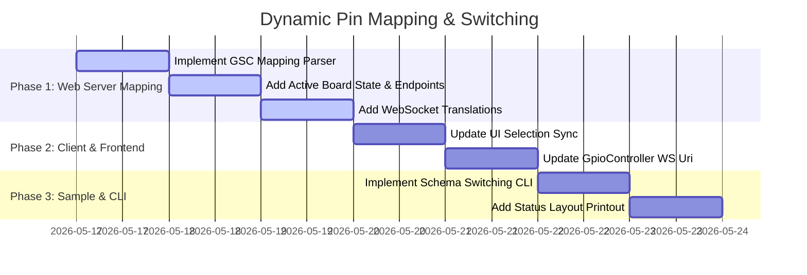

# Implementation Plan - Dynamic Pin Mapping & Switching

This document maps out the concrete tasks required to implement dynamic pin numbering schemes mapping and switching.

---

## Plan & Wave Schedule

### Wave 1: Web Server Mapping Engine (`DevDecoder.GpioSimulator.Web`)
1. **GSC Parse Helper**: Add logic to load the `.gsc` file and extract standard `{ physical: logical }` pairs.
2. **State & Endpoints**:
   - Store `activeBoardId` and mapping dictionaries.
   - Default to `"raspberry_pi_5"` and parse its GSC on startup.
   - Implement `POST /api/board/active?boardId=...` to set layout.
3. **WS Connection Client Scheme Metadata**:
   - Parse `scheme` parameter on WebSocket connection.
   - Update `clients` map to track `(WebSocket Socket, string Type, string Scheme)`.
4. **On-the-fly Translation Loop**:
   - Translate pin indices dynamically on message receive and broadcast.

### Wave 2: Front-End UI Sync (`wwwroot/main.js`)
1. **Selection Sync**:
   - In `loadBoard(boardId)`, invoke `fetch(`/api/board/active?boardId=${boardId}`, { method: 'POST' })` to sync server layout state.

### Wave 3: GpioController Websocket Connection Scheme (`System.Device.Gpio`)
1. **URI Query Parameter**:
   - Update `_wsClient.ConnectAsync` to append `&scheme={NumberingScheme}` query parameter.

### Wave 4: Sample & CLI (`DevDecoder.GpioSimulator.Sample`)
1. **Interactive Prompt**: Allow user to choose standard scheme on boot.
2. **Dynamic Switch Command**: Add `scheme` / `schema` command to close old controller and launch new one dynamically.
3. **Layout Status Display**: Add numbering scheme printout to the active console layout.
