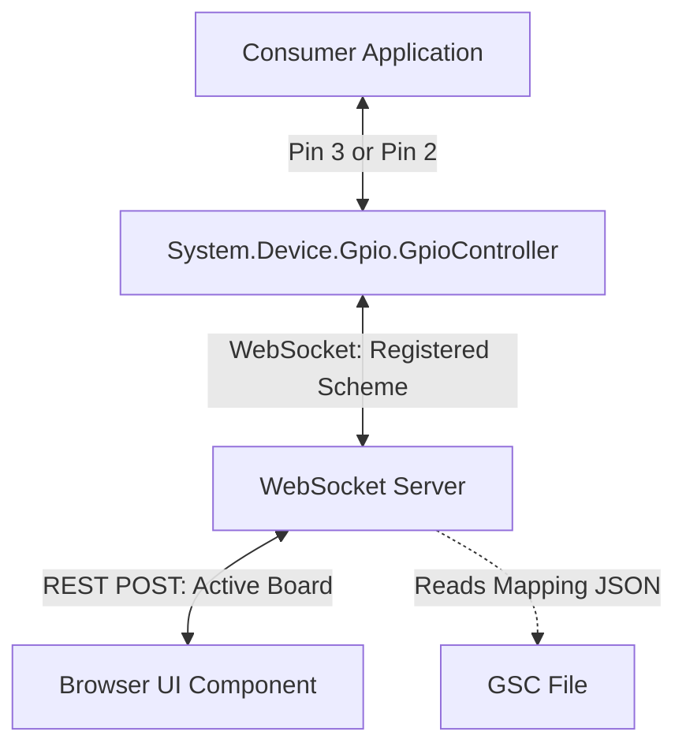

# Design Specification - Server-Driven Dynamic Pin Mapping

This specification defines the lightweight, network-level dynamic translation layer that enables the GPIO Simulator to transparently support both `Logical` (BCM) and `Board` (physical header) pin numbering schemes.

---

## 1. Architecture Overview

By resolving pin translation at the WebSocket network boundary rather than hardcoding it inside `System.Device.Gpio.GpioController`, we preserve clean standards compatibility while gaining infinite support for arbitrary board layouts.

---

## 2. Component Design

### 2.1. Controller Scheme Registration (`System.Device.Gpio`)
* During WebSocket connection initialization, `GpioController` passes its active numbering scheme as a query parameter:
  `ws://127.0.0.1:5050/ws?client=controller&scheme=Board` or `scheme=Logical`.
* The `GpioController` remains completely scheme-agnostic internally, passing all pin values as-is.

### 2.2. Web Server Translation Registry (`DevDecoder.GpioSimulator.Web`)
* **State Management**:
  * Tracks `activeBoardId` (defaults to `"raspberry_pi_5"`).
  * Automatically parses active GSC board layouts to populate `physToLog` and `logToPhys` translation tables.
* **API Endpoints**:
  * `POST /api/board/active?boardId=...` - Invoked by Browser UI to set active layout, causing the server to hot-reload GSC pin mappings.
* **Translation Pipeline**:
  * **Incoming from UI (always Logical)**: Broadcasts to controllers. If a controller's scheme is `Board`, maps pin number `logical -> physical` before sending.
  * **Incoming from Controller**: If controller has `scheme == Board`, maps pin number `physical -> logical` before updating state and broadcasting to UI.

---

## 4. Architectural Decision Record (ADR): Defaulting to Physical Board Pin Numbers

### 4.1. Status
**Accepted & Implemented** (May 17, 2026)

### 4.2. Context
The browser-based visualizer shows the physical pin locations (1-40) on the breakout board or header, which is the most intuitive and robust way for developers to interact with the simulated hardware. 

Previously, the Web Server used **Logical** pin numbering (BCM/GPIO IDs) as its internal storage representation and keying mechanism. This meant that:
- Server console logs reported logical GPIO pin transitions (e.g., configuring GPIO 2 or writing to GPIO 3).
- Visual-to-console mapping was confusing because developers had to mentally map physical pins shown in the browser to logical IDs logged in the terminal.

### 4.3. Decision
Standardize on the physical **Board Numbering (Physical)** scheme as the canonical internal keying mechanism in the Web Server and the default communication scheme for the Web UI:
1. When clients connect without explicitly providing a scheme (e.g., the browser UI), they default to `"Board"` numbering.
2. The internal `pinStates` dictionary keys represent physical pin numbers (1-40) instead of logical GPIO pins.
3. Server-side terminal logs print physical board pin numbers directly (e.g., `Physical Pin 5 state set to: High`), aligning 100% with the visual markers in the browser.
4. Symmetrical network translation maps to/from logical coordinates at the WebSocket boundary when standard-compliant `Logical` clients (such as standard consumer application controllers) connect.

### 4.4. Consequences
- **Improved Usability**: Developers see immediate, 1:1 correlation between visual board sockets in the UI and physical pin numbers reported in both server and UI logs.
- **Robustness**: Pin states are anchored to their fixed physical locations (which are board-dependent but physically static) rather than changing with dynamic logic configurations.
- **API Compatibility**: High-fidelity compatibility with Microsoft's `System.Device.Gpio` (which defaults to logical numbering) is fully preserved at the WebSocket boundary.

