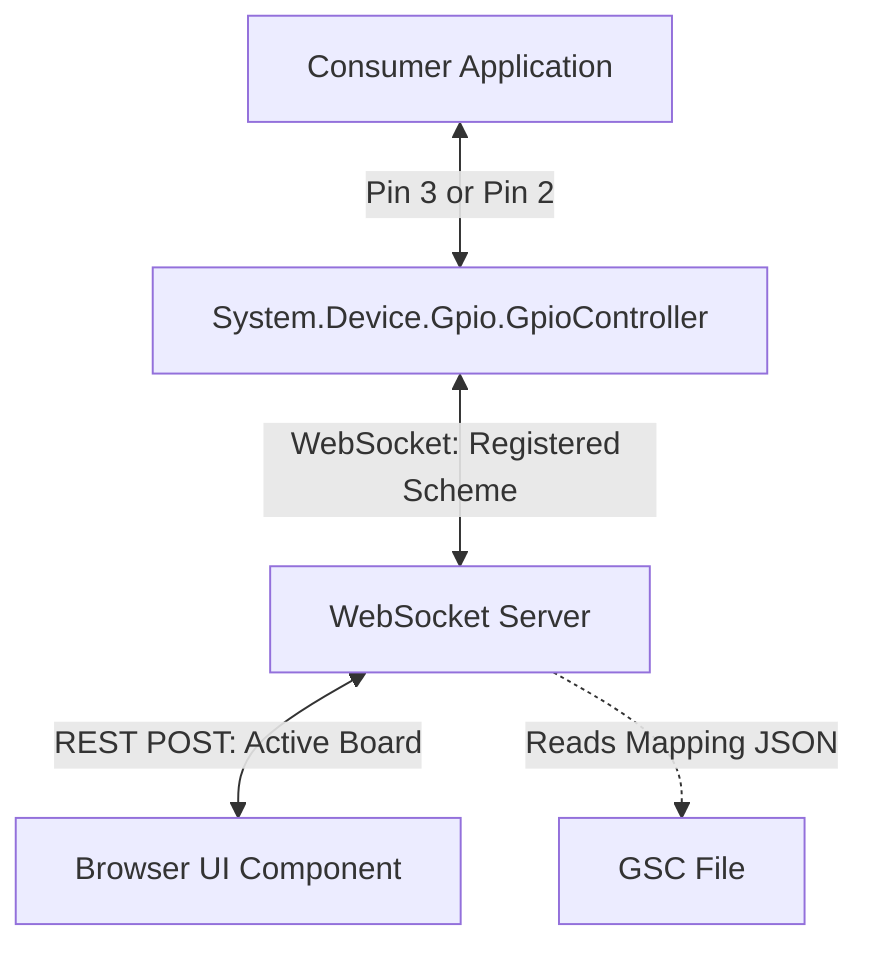

# Design Specification - Server-Driven Dynamic Pin Mapping

This specification defines the lightweight, network-level dynamic translation layer that enables the GPIO Simulator to transparently support both `Logical` (BCM) and `Board` (physical header) pin numbering schemes.

---

## 1. Architecture Overview

By resolving pin translation at the WebSocket network boundary rather than hardcoding it inside `System.Device.Gpio.GpioController`, we preserve clean standards compatibility while gaining infinite support for arbitrary board layouts.

---

## 2. Component Design

### 2.1. Controller Scheme Registration (`System.Device.Gpio`)
* During WebSocket connection initialization, `GpioController` passes its active numbering scheme as a query parameter:
  `ws://127.0.0.1:5050/ws?client=controller&scheme=Board` or `scheme=Logical`.
* The `GpioController` remains completely scheme-agnostic internally, passing all pin values as-is.

### 2.2. Web Server Translation Registry (`DevDecoder.GpioSimulator.Web`)
* **State Management**:
  * Tracks `activeBoardId` (defaults to `"raspberry_pi_5"`).
  * Automatically parses active GSC board layouts to populate `physToLog` and `logToPhys` translation tables.
* **API Endpoints**:
  * `POST /api/board/active?boardId=...` - Invoked by Browser UI to set active layout, causing the server to hot-reload GSC pin mappings.
* **Translation Pipeline**:
  * **Incoming from UI (always Logical)**: Broadcasts to controllers. If a controller's scheme is `Board`, maps pin number `logical -> physical` before sending.
  * **Incoming from Controller**: If controller has `scheme == Board`, maps pin number `physical -> logical` before updating state and broadcasting to UI.

---

## 3. Benefits

1. **Zero Client Overhead**: No complex dictionary search or mapping inside `System.Device.Gpio`.
2. **Standard-Compliant**: No custom C# helpers needed, avoiding any namespace bloat or deviations.
3. **Cross-Board Support**: Seamlessly supports Arduino Uno, Raspberry Pi 5, or custom boards loaded dynamically in the browser.
