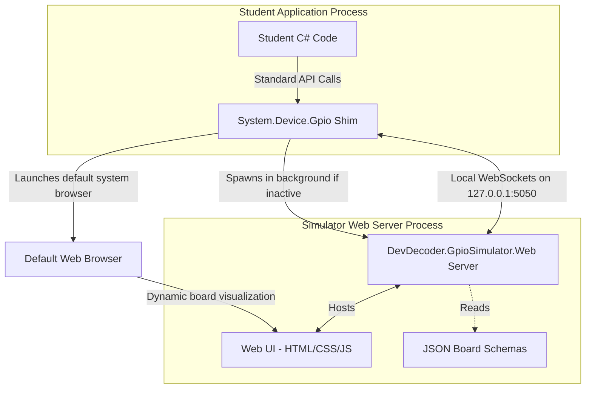

# General-Purpose GPIO Simulator Design Specification

## Goal
Create an extensible, drop-in NuGet replacement for the official `.NET IoT` library `System.Device.Gpio` that mimics its API namespace and behavior exactly, but instead of interacting with physical hardware, it automatically launches a local, cross-platform web simulator interface. 

This design focuses on **extensibility**, allowing the simulator to represent multiple different microcontrollers and microcomputers (e.g. Raspberry Pi 5, Raspberry Pi 4, Arduino Uno) via metadata-driven schemas, keeping the client code clean, drop-in, and friction-free.

---

## Extensible Architecture Overview

The solution is split into two components connected by a local WebSocket protocol:
1. **The Gpio Shim Library (`System.Device.Gpio`)**:
   * Target Framework: `.NET Standard 2.0` (supports `.NET Core 2.0` and above).
   * Responsibility: Exposes the identical API surface as `System.Device.Gpio` (e.g. `GpioController`). On initialization, it spawns the background web server, opens the browser, and syncs pin configurations.
2. **The Simulator Web Server (`DevDecoder.GpioSimulator.Web`)**:
   * Target Framework: `.NET 8.0` (uses modern ASP.NET Core, minimal APIs, and built-in WebSockets).
   * Responsibility: Serves the dynamically-rendered HTML/CSS/JS frontend. Renders the board visuals dynamically based on JSON Board Schemas.



---

## Core Component Specifications

### 1. The Gpio Shim Library (netstandard2.0)

Compiles to `System.Device.Gpio.dll` and mimics the official namespace:

* **Namespace**: `System.Device.Gpio`
* **Core APIs**:
  * `GpioController`
    * `GpioController()`
    * `OpenPin(int pinNumber, PinMode mode)`
    * `ClosePin(int pinNumber)`
    * `Write(int pinNumber, PinValue value)`
    * `Read(int pinNumber) : PinValue`
    * `SetPinMode(int pinNumber, PinMode mode)`
  * `PinMode` (Enum: `Input`, `Output`, `InputPullUp`, `InputPullDown`)
  * `PinValue` (Struct representing `High`/`Low`)

#### Loopback Server Spawning
On GpioController initialization:
1. Checks for an active simulator on `http://127.0.0.1:5050/api/status`.
2. If offline, launches the background process via the host `dotnet` runtime:
   ```bash
   dotnet DevDecoder.GpioSimulator.Web.dll --urls http://127.0.0.1:5050
   ```
3. Opens the default browser to the loopback URL. Binds strictly to `127.0.0.1` to avoid all OS firewall prompts.

---

### 2. Extensible Web Simulator UI (.NET 8.0)

Instead of hardcoding a specific board layout (like a 40-pin Raspberry Pi grid), the Web UI uses a **Metadata-Driven Board Schema Engine**.

#### A. JSON Board Schema (`board_schemas/`)
Each supported board is defined in a separate JSON schema file. For example, `raspberry_pi_5.json`:

```json
{
  "boardId": "raspberry_pi_5",
  "displayName": "Raspberry Pi 5",
  "layoutType": "dual_row_header",
  "visuals": {
    "boardColor": "#008000",
    "pinColumns": 2,
    "totalPins": 40
  },
  "pins": [
    { "physical": 1, "logical": null, "name": "3.3V Power", "supportedModes": [] },
    { "physical": 2, "logical": null, "name": "5V Power", "supportedModes": [] },
    { "physical": 3, "logical": 8, "name": "GPIO 8 (SDA)", "supportedModes": ["Input", "Output"] },
    { "physical": 4, "logical": null, "name": "5V Power", "supportedModes": [] },
    { "physical": 5, "logical": 9, "name": "GPIO 9 (SCL)", "supportedModes": ["Input", "Output"] }
  ]
}
```

An Arduino Uno Schema (`arduino_uno.json`) would specify a single-row digital header and a separate analog header:

```json
{
  "boardId": "arduino_uno",
  "displayName": "Arduino Uno R3",
  "layoutType": "split_headers",
  "visuals": {
    "boardColor": "#006699"
  },
  "pins": [
    { "physical": 1, "logical": 0, "name": "Digital 0 (RX)", "supportedModes": ["Input", "Output"] },
    { "physical": 14, "logical": 14, "name": "Analog In A0", "supportedModes": ["Input", "AnalogInput"] }
  ]
}
```

#### B. The Dynamic Board Render Engine
1. **Interactive Layouts**: The frontend reads the current board JSON and dynamically draws the board shape, color, and pin sockets using SVG/HTML.
2. **Interactive Controls**:
   * **Outputs**: Represented by virtual LEDs. Setting a pin to `High` lights the LED; `Low` dims it.
   * **Inputs (Digital)**: Clickable pushbuttons or slide toggles that send the pin transition back to the running Shim process via WebSockets.
   * **Inputs (Analog - Extensible)**: Slider controls representing voltage (0V to 5V), allowing students to simulate reading analog sensors.
3. **Board Selection UI**: A clean dropdown menu in the Web UI allows students/teachers to switch between boards (e.g., "Raspberry Pi 5", "Raspberry Pi 4", "Arduino Uno") on the fly. The UI updates the active schema and transmits the pin mappings back to the running Shim in real time.

---

## Communication Protocol (JSON WebSockets)

Client-Server interactions occur over a bi-directional loopback WebSocket connection:

### A. Initialization & Schema Exchange
* **App to Web**: `{"action": "client_connect", "version": "1.0.0"}`
* **Web to App**: `{"action": "active_board", "boardId": "raspberry_pi_5"}`

### B. Pin Operations
* **Set Pin Mode** (App -> Web):
  ```json
  {"action": "set_mode", "pin": 3, "mode": "Output"}
  ```
* **Write Pin State** (App -> Web):
  ```json
  {"action": "write", "pin": 3, "value": "High"}
  ```
* **Read Pin State** (Web -> App):
  ```json
  {"action": "read", "pin": 5, "value": "High"}
  ```
