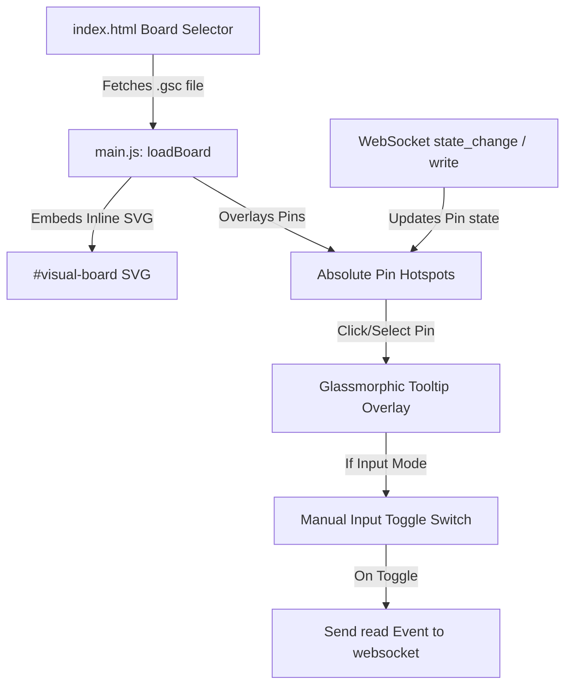

# Premium Geo-Mapped Component Simulation Design

A comprehensive specifications and design blueprint for introducing visually stunning vector graphics boards and components into the DevDecoder GPIO Board Simulator, utilizing embedded SVGs, percentage-based absolute pin coordinates, and premium glassmorphic control overlays.

---

## 1. Architectural Changes

### 1.1 Components Renaming & Unified File Format
* **Folder Structure**: Renamed the `/wwwroot/board_schemas/` folder to `/wwwroot/components/` to allow for other custom simulated modules in the future (e.g., breakout boards, breadboards, shields).
* **Unique Extension**: Adopted the safe three-letter extension **`.gsc`** (GPIO Sim Component) for definition files.
* **MIME Type Service Config**: Configured `FileExtensionContentTypeProvider` in ASP.NET Core static files middleware to map `.gsc` files as `application/json` to prevent server `404 Not Found` response behavior.

### 1.2 Embedded SVG & Dynamic Overlay Positioning
Instead of simple box grid elements, we load full board vector diagrams embedded in the `.gsc` files and map the coordinate points relative to the SVG canvas.
* **Canvas Coordinate Engine**: Pins are defined in `.gsc` component files using specific `x` and `y` coordinates based on standard board grid coordinates (e.g. $600 \times 400$).
* **Percentage-Based Responsive Scaling**:
  The front-end maps interactive pin overlays using absolute placement:
  $$\text{Left \%} = \frac{x}{\text{canvasWidth}} \times 100\%$$
  $$\text{Top \%} = \frac{y}{\text{canvasHeight}} \times 100\%$$
  This ensures that the pins scale responsively with the board image without breaking the alignment of hotspot elements!

---

## 2. Interactive Interactivity (Option B Controls)

### 2.1 Floating Glassmorphic Tooltip Panel
When a pin hotspot is clicked, a floating dashboard card smoothly transitions onto the screen containing:
* **Identification details**: Displays physical pin index, logical GPIO ID, name/function.
* **Dynamic Mode Badges**: Color-coded badges for modes (`Input`, `Output`, `None`).
* **Active State LED Indicator**: A glowing indicator dot showing logic levels (`High` in neon green, `Low` in red).
* **Manual Input driver**: An iOS-style slider switch that allows students to drive simulated inputs `High` or `Low` interactively, firing WebSocket events instantly.

---

## 3. Visual Assets Schema

### 3.1 Raspberry Pi 5 (`raspberry_pi_5.gsc`)
* **Color**: Rich Pi Green (`#0d5c34`).
* **Graphics**: Contains Micro-HDMI ports, USB-C ports, dual stacked USB 3.0/2.0 ports, RP1 chip, and a Broadcom SoC chip block.
* **GPIO Header**: A unified 40-pin grid header with gold-accented overlays.

### 3.2 Arduino Uno R3 (`arduino_uno.gsc`)
* **Color**: Sleek Deep Blue (`#006699`).
* **Graphics**: ATmega328P DIP long-chip notch, silver USB Type-B socket, DC Power Jack, red physical reset button, and crystal oscillator.
* **Header Split**: Authentic split headers mapping separate Digital (0-13, GND, AREF) and Power/Analog groups.

---

## 4. UI Style Guide (Style System)
* **Typography**: Outfit Google Font family for clean UI details, Fira Code for mono activity terminal logs.
* **Indicators**:
  * *Power (5V)*: Solid red glowing boundary.
  * *Power (3.3V)*: Amber orange glowing boundary.
  * *Ground (GND)*: Dark steel gray circle.
  * *GPIO Active High*: Vibrant glowing neon green aura (`#39ff14`).
