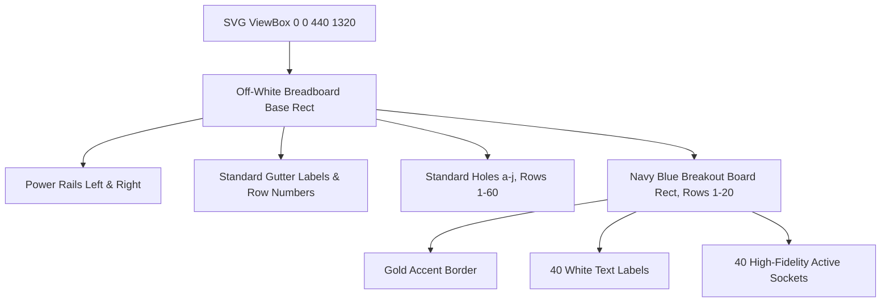

# Design Specification: Raspberry Pi 5 Breakout Breadboard Component

A design specification and coordinate system schema for the Raspberry Pi 5 Breakout Breadboard component (`raspberry_pi_5_breakout.gsc`). This document establishes the premium vector layout, visual properties, grid spacing, and absolute coordinate mappings for the 40-pin Raspberry Pi 5 breakout overlay.

---

## 1. Grid & Geometry Specifications

### 1.1 Canvas Dimensions
* **Width**: `440px`
* **Height**: `1320px`
* This vertical layout maintains the authentic proportions of a standard 60-row half-plus or full-size breadboard with active power rails.

### 1.2 Spacing & Alignments
* **Row Height**: `20px` (60 rows total, spanning $y = 60\text{px}$ to $y = 1240\text{px}$)
* **Column Width**: `22px`
* **Center Trough**: `44px` wide (separating column `e` and `f`)
* **Gutter for Row Numbers**: Centered between column `c` and `d` (left side) and `g` and `h` (right side) to preserve visibility when the breakout board is plugged in.

---

## 2. Color Palette & Premium Aesthetics

To deliver a jaw-dropping visual experience that aligns with our premium design standards, the visual assets use a high-contrast dark/light motif:

| Element | Hex Color | Description |
| :--- | :--- | :--- |
| **Breadboard Body** | `#fafaf9` | Smooth off-white modern ceramic base |
| **Breakout PCB** | `#0b1329` | Gorgeous deep navy blue solder mask |
| **Board Accent Border** | `#c5a059` | Brushed gold/bronze silkscreen dashed line |
| **Text Labels** | `#ffffff` | High-visibility clean white silkscreen |
| **Power Bus (+)** | `#ef4444` | Vibrant red rail line |
| **Power Bus (-)** | `#0284c7` | Sleek neon blue rail line |
| **Contact Holes** | `#d6d3d1` | Soft metallic steel gray socket pins |

---

## 3. SVG Structure Diagram

---

## 4. Pin Coordinate Mappings

All 40 pins on the Raspberry Pi 5 breakout board map to the exact center of column `e` (left pins, $x = 188$) and column `f` (right pins, $x = 254$) from row 1 to row 20:

### 4.1 Odd Physical Pins (Left Column, $x = 188$)

| Physical Pin | Row | Name | Y Coordinate |
| :---: | :---: | :---: | :---: |
| **1** | 1 | 3.3V | `60` |
| **3** | 2 | SDA1 | `80` |
| **5** | 3 | SCL1 | `100` |
| **7** | 4 | GPIO4 | `120` |
| **9** | 5 | GND | `140` |
| **11** | 6 | GPIO17 | `160` |
| **13** | 7 | GPIO27 | `180` |
| **15** | 8 | GPIO22 | `200` |
| **17** | 9 | 3.3V | `220` |
| **19** | 10 | MOSI | `240` |
| **21** | 11 | MISO | `260` |
| **23** | 12 | SCLK | `280` |
| **25** | 13 | GND | `300` |
| **27** | 14 | SDA0 | `320` |
| **29** | 15 | GPIO5 | `340` |
| **31** | 16 | GPIO6 | `360` |
| **33** | 17 | GPIO13 | `380` |
| **35** | 18 | GPIO19 | `400` |
| **37** | 19 | GPIO26 | `420` |
| **39** | 20 | GND | `440` |

### 4.2 Even Physical Pins (Right Column, $x = 254$)

| Physical Pin | Row | Name | Y Coordinate |
| :---: | :---: | :---: | :---: |
| **2** | 1 | 5V | `60` |
| **4** | 2 | 5V | `80` |
| **6** | 3 | GND | `100` |
| **8** | 4 | TXD0 | `120` |
| **10** | 5 | RXD0 | `140` |
| **12** | 6 | GPIO18 | `160` |
| **14** | 7 | GND | `180` |
| **16** | 8 | GPIO23 | `200` |
| **18** | 9 | GPIO24 | `220` |
| **20** | 10 | GND | `240` |
| **22** | 11 | GPIO25 | `260` |
| **24** | 12 | CE0 | `280` |
| **26** | 13 | CE1 | `300` |
| **28** | 14 | SCL0 | `320` |
| **30** | 15 | GND | `340` |
| **32** | 16 | GPIO12 | `360` |
| **34** | 17 | GND | `380` |
| **36** | 18 | GPIO16 | `400` |
| **38** | 19 | GPIO20 | `420` |
| **40** | 20 | GPIO21 | `440` |

---

## 5. UI Integration

* **Selection Toggle**: A dropdown or visual selector in `index.html` will allow switching between `raspberry_pi_5` (bare green board) and `raspberry_pi_5_breakout` (this breadboard template).
* **Pin Hover Glows**: The visual engine in `main.js` will read the coordinates and overlay the interaction points exactly on top of the circles, preserving dynamic hover overlays, tooltips, and digital logic color shifts.
