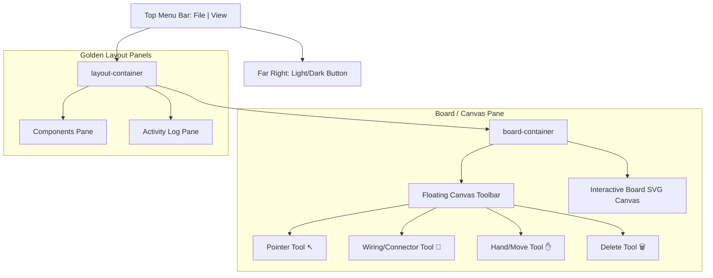

# UI Enhancements Design Specification

This document details the architectural design and styling contract for upgrading the DevDecoder GPIO Board Simulator into a professional, desktop-like visual prototyping workspace using Golden Layout v2, customized menu controls, and localized canvas tools.

## 1. Architectural Overview

To support the future roadmap of building and simulating custom electronic circuits, the single-column UI layout is replaced with a responsive, multi-pane windowing system. 



### Components and Responsibilities

1.  **Menu Bar (`#menu-bar`)**: Anchored globally at the top of the viewport. Provides dropdown options for File operations (Open, Save) and View toggles (Logs, Components). Includes the Light/Dark mode toggle at the top right.
2.  **Simulator Workspace (`board-container`)**: Serves as the central design canvas where board graphics are rendered. Displays a floating glassmorphism toolbar (`#canvas-toolbar`) at the top center to switch active simulation tools.
3.  **Components Pane (`#components-panel`)**: Positioned on the left side of the workspace. Lists available board models under a categorized list (Boards, Discrete Components). Allows selecting a board to load onto the workspace.
4.  **Activity Log (`#terminal-panel`)**: Positioned at the bottom, showing real-time event logs from WebSocket communication. Can be closed or toggled back on via the View menu.

---

## 2. Layout Specifications & Themes

### 2.1 CSS Theme Variables
We establish a unified color system supporting seamless transitions between Dark and Light modes.

```css
:root {
    /* Global Variables - Default Dark mode */
    --bg-color: #0b0c10;
    --card-bg: rgba(22, 24, 30, 0.85);
    --text-color: #c5c6c7;
    --text-bright: #ffffff;
    --accent: #66fcf1;
    --accent-dim: #45a29e;
    --accent-glow: rgba(102, 252, 241, 0.25);
    
    --border-color: rgba(102, 252, 241, 0.15);
    --menu-bg: #07090e;
    --menu-hover: rgba(102, 252, 241, 0.1);
    
    --card-hover-border: var(--accent);
    --card-hover-bg: rgba(102, 252, 241, 0.03);
    
    /* Device Specific Colors */
    --led-off: #2e3033;
    --led-on: #39ff14;
    --power-color: #ff3838;
    --v3-color: #ff9f43;
    --gnd-color: #576574;
    --input-color: #3498db;
    --output-color: #9b59b6;
}

body.light-theme {
    /* Light Mode Overrides */
    --bg-color: #f5f6fa;
    --card-bg: rgba(255, 255, 255, 0.9);
    --text-color: #2f3640;
    --text-bright: #1e272e;
    --accent: #00a8ff;
    --accent-dim: #0097e6;
    --accent-glow: rgba(0, 168, 255, 0.2);
    
    --border-color: rgba(0, 168, 255, 0.15);
    --menu-bg: #ffffff;
    --menu-hover: rgba(0, 168, 255, 0.08);
    
    --card-hover-border: var(--accent);
    --card-hover-bg: rgba(0, 168, 255, 0.02);
}
```

---

## 3. UI Interactions & Controls

### 3.1 Menu Items & Commands
-   **File -> Open**: Triggers a hidden `<input type="file">`.
    -   Loads `.gsl` (Layout) JSON: restores board states, connections, and loads components.
    -   Loads `.gsc` (Component/Board) JSON: dynamically parses and appends it to the Boards or Components list.
-   **File -> Save**: Bundles the current board and simulator connections into a `.gsl` JSON layout and initiates a browser file download.
-   **View -> Components**: Re-adds the Components pane if it has been closed, placing it on the left-hand column stack.
-   **View -> Logs**: Re-adds the Activity Log pane if closed, placing it at the bottom of the right-hand column stack.

### 3.2 Light/Dark Mode Switcher
-   An animated toggle button (`#theme-toggle`) is embedded on the far right of the top menu bar.
-   Swaps stylesheet links dynamically to swap Golden Layout themes without reloading:
    -   **Dark Style URL**: `https://cdn.jsdelivr.net/npm/golden-layout@2.6.0/dist/css/themes/goldenlayout-dark-theme.css`
    -   **Light Style URL**: `https://cdn.jsdelivr.net/npm/golden-layout@2.6.0/dist/css/themes/goldenlayout-light-theme.css`
-   Stores theme preference in `localStorage.setItem('theme', 'light' | 'dark')`.

### 3.3 Canvas Interactive Toolbar
-   Positioned floating at the top center of `#board-container`.
-   Contains 4 tool buttons:
    *   **Pointer Tool**: Click to toggle manual board inputs and view tooltip details. Changes cursor to `default`.
    *   **Wiring Tool**: Click and drag from pin to pin to establish connections. Changes cursor to `crosshair`.
    *   **Move Tool**: Holds the board canvas in pan mode. Changes cursor to `grab` / `grabbing`.
    *   **Delete Tool**: Direct click on items to delete. Changes cursor to `alias` / delete indicator.
-   Active tools display a colored selection ring and update the status badge on the right of the toolbar.

---

## 4. Components Catalog System
-   The **Components View** is divided into categories:
    1.  **Available Boards**: Raspberry Pi 5 (Breakout), Raspberry Pi 5, Arduino Uno R3, plus any custom `.gsc` board files loaded via Open.
    2.  **Discrete Components** (Discrete placeholders): LED, Push Button, Resistor. Shown as disabled cards to preview future expansion capabilities.
-   Switching boards in this list triggers a client-side layout reload, resetting socket states, and dynamically drawing the active hotspots in the Canvas workspace.
