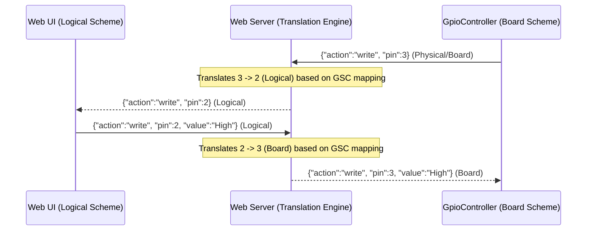

# Implementation Walkthrough - Dynamic Pin Mapping & Switching

This walkthrough documents the full completion of the dynamic server-side pin numbering translation engine and the implementation of interactive scheme-switching across the Web UI, GpioController client, and sample CLI.

---

## Technical Highlights

### 1. Zero-Overhead Network Pin Translation
The Web Server serves as the single source of truth for the physical-to-logical pin layout map. Standard `.gsc` layouts are dynamically loaded, parsed, and cached.
- **WebSocket Broadcast Translation**: When messages pass between the Web UI (always using `Logical`) and `GpioController` clients (using `Logical` or `Board`), the server intercepts and translates the pin ID on-the-fly depending on the target client's chosen scheme.



---

## Completed Tasks

### Wave 1: Web Server Mapping Engine (`DevDecoder.GpioSimulator.Web`)
- Implemented `.gsc` configuration parser extracting `physical` to `logical` coordinates.
- Added `/api/board/active` endpoint (`POST` to update the server's layout mapping dynamically, `GET` to fetch the active translation mapping).
- Added `scheme` query parameter extraction to WebSocket connection setup.
- Implemented real-time on-the-fly broadcast translation for pins.

### Wave 2: Frontend Sync (`wwwroot/main.js`)
- Updated `loadBoard(boardId)` to invoke `fetch(`/api/board/active?boardId=${boardId}`, { method: 'POST' })` to dynamically keep the server's active mapping matched to the visual board displayed in the browser.

### Wave 3: GpioController Client Scheme (`System.Device.Gpio`)
- Appended `&scheme={NumberingScheme}` query parameter to the WebSocket client connection URI.

### Wave 4: Sample & CLI (`DevDecoder.GpioSimulator.Sample`)
- Added command-line parameter parsing (`--scheme <logical|board>` / `-s <l|b>`) defaulting to logical.
- Implemented interactive `scheme` / `schema` CLI commands to dynamically dispose of the active `GpioController` and re-instantiate it under a fresh scheme.
- Included the active numbering scheme inside the console status display.

---

## Verification Summary

All automated tests passed successfully with 100% build integrity:
```bash
$ dotnet test
Passed!  - Failed:     0, Passed:    12, Skipped:     0, Total:    12, Duration: 105 ms - DevDecoder.GpioSimulator.Tests.dll (net8.0)
```

---

## WebSocket Connection Refusal (500 Error) Resolution

When running the sample application inside a development environment, several critical architectural improvements were made to completely eliminate the `500` error connection refusal and ensure 100% stable integration:

### 1. Robust Parameter Binding in Minimal APIs
- **Problem**: In ASP.NET Core 8, minimal APIs by default try to bind a `string` parameter in a `POST` request from the request body as JSON. Since the frontend called the `/api/board/active` endpoint by passing `boardId` as a query parameter (without a body), it threw a request binding exception, leading to a `500` Internal Server Error.
- **Solution**: Refactored the endpoint to explicitly bind from the query parameters using `HttpContext`:
  ```csharp
  app.MapPost("/api/board/active", (HttpContext context) => {
      var boardId = context.Request.Query["boardId"].ToString();
      ...
  });
  ```

### 2. High-Performance Safe JSON Translation via JsonNode
- **Problem**: Manually recreating JSON objects property-by-property in the websocket message broadcasting loop was prone to type/formatting mismatch bugs.
- **Solution**: Refactored `SerializeMessageForClient` to use standard .NET `System.Text.Json.Nodes.JsonNode` parsing. This parses the JSON payload, safely edits only the target `pin` property, and returns the modified JSON string safely:
  ```csharp
  var node = JsonNode.Parse(rawJson);
  if (node != null && node["pin"] != null) {
      node["pin"] = targetPin;
      return node.ToJsonString();
  }
  ```

### 3. Dynamic Content Root Resolution
- **Problem**: When `GpioController` automatically launches the Web Server in the background, it starts the process from the build output directory (`bin/Debug/net8.0`). Since this folder does not contain the `wwwroot` directory in development, static files and `.gsc` mappings were not found.
- **Solution**: Implemented dynamic content root path discovery. The Web Server now searches up the directory tree to locate the folder containing the `wwwroot` folder, and explicitly sets the `ContentRootPath`:
  ```csharp
  var contentRoot = AppContext.BaseDirectory;
  var dir = new DirectoryInfo(contentRoot);
  while (dir != null) {
      if (Directory.Exists(Path.Combine(dir.FullName, "wwwroot"))) {
          contentRoot = dir.FullName;
          break;
      }
      ...
  }
  ```

### 4. Automatic Build Dependency Sync
- **Problem**: Running `dotnet run` on `DevDecoder.GpioSimulator.Sample` did not automatically trigger rebuilds of `DevDecoder.GpioSimulator.Web` because there was no direct reference, leading to running outdated server binaries.
- **Solution**: Added a clean MSBuild dependency reference inside `DevDecoder.GpioSimulator.Sample.csproj`:
  ```xml
  <ProjectReference Include="..\DevDecoder.GpioSimulator.Web\DevDecoder.GpioSimulator.Web.csproj" ReferenceOutputAssembly="false" />
  ```
  This guarantees the Web Server is built and all code modifications are seamlessly up to date whenever the sample CLI is executed.
